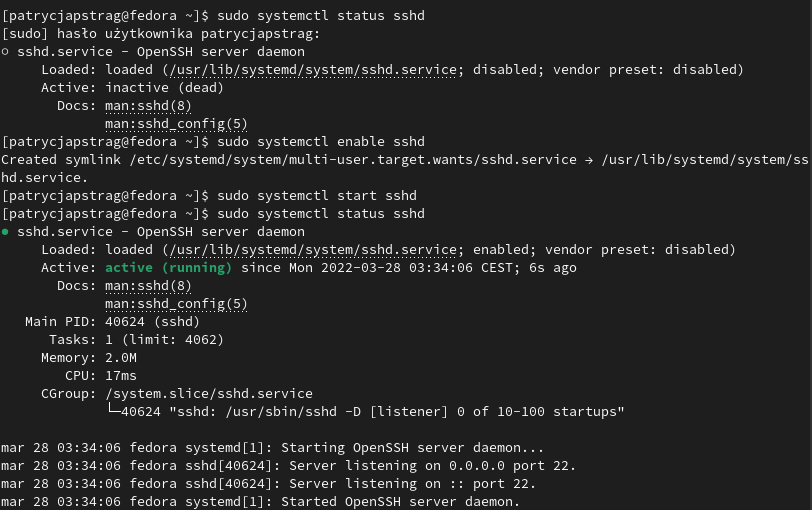

# SPRAWOZDANIE LAB02 
Patrycja Pstrąg 401409

1. Wyświetlenie zawartości katalogu hooks


2. Przygotowanie git hooka sprawdzającego czy w tytule commita znajduje się PP401409, oraz czy w treści commita znajduje się numer laboratorium.


```sh
#!/bin/bash
a=`head -n1 $1`
b=`tail -n1 $1`
i='PP401409'	
nr_l='Lab02'

if ! [[ "$a" = $i ]]; then
    echo "ERROR"
    echo "Wpisany tytul commita: " $a
    echo "Wlasciwy tytul commita to: " $i
    exit 1
fi

if ! [[ "$b" = $nr_l ]]; then
    echo "ERROR"
    echo "Wpisana tresc commita: " $b 
    echo "Wlasciwa tresc commita to: " $nr_l
    exit 1
fi

echo "Commit message OK!"
exit 0
```

Przykład działania
a) niewłaściwy tytuł commita


b) właściwy tytuł commita ale niewłaściwa treść commita


c) właściwy tytuł i treść


3. Przygotowanie środowiska Dockerowego:
`sudo dnf install docker` Instalacja dockera
`docker --version` Sprawdzenie wersji dockera

`systemctl status docker` Sprawdzenie czy docker jest uruchomiony


`ifconfig` Wyświetlenie interfejsu sieciowego w celu nawiąznia połączenia z Windowsem


4.Łączenie za pomocą ssh
a) `sudo systemctl status sshd` sprawdzenie statusu ssh
b) `sudo systemctl enable sshd`
c) `sudo systemctl start sshd` uruchomienie ssh
d) ponowne sprawdzenie statusu



