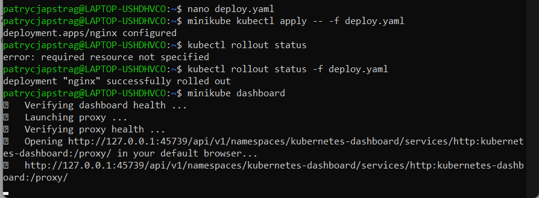
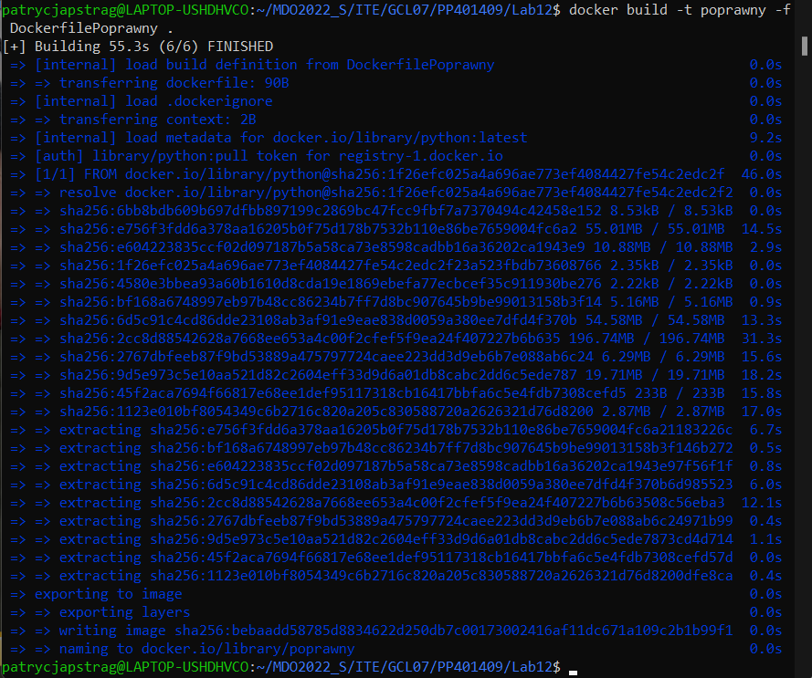
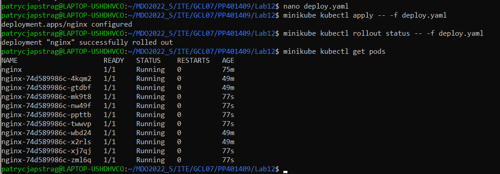

## Sprawozdanie Lab12 Patrycja Pstrąg
# Konwersja wdrożenia ręcznego na wdrożenie deklaratywne YAML

Wzbogacamy obraz o 4 repliki. Aby to zrobić w pliku deploy.yaml zmieniamy parametr ``` replicas ``` na 4:


A następnie rozpoczynamy wdrożenie z użyciem zmodyfikowanego pliku deploy.yaml za pomocą komendy ```minikube kubectl apply -- -f deploy.yaml```.

Za pomocą ``` kubectl rollout status ``` sprawdzam stan wdrożenia i uruchamiam dashboard ``` minikube dashboard ```. Wszystkie te kroki, łącznie z przypadkowym kliknięciem Enter w czasie wpisywania komendy przedstawia poniższy zrzut ekranu:




## Nowy obraz
Tak jak i w poprzednim laboratorium - korzystam z obrazu-gotowca. Przygotowuje dwa obrazy lokalne, jeden poprawny o nazwie "**poprawny**" i drugi niepoprawny, w którym celowo zrobiłam błąd o nazwie "**niepoprawny**". Komendy oraz efekty zbudowania przedstawiają poniższe zrzuty ekranu:

``` docker build -t poprawny -f DockerfilePoprawny . ```



``` docker build -t niepoprawny -f DockerfileNiepoprawny . ```
oraz uruchomiłam obraz ``` docker run --rm niepoprawny ```


## Zmiany w deploy.yaml

Zmieniam plik deploy.yaml z wdrożeniem i przeprowadzam je ponownie po zmianach dotyczących replik (czyli zmieniam wartość parametru ```replicas```). A następnie sprawdzam pody za pomocą polecenia ``` minikube kubectl get pods``` aby sprawdzić czy wszystko poszło zgodnie z oczekiwaniami. Do przeprowadzenia wdrożeń używam komendy ``` minikube kubectl apply -- -f deploy.yaml``` oraz ```minikube kubectl rollout status -- -f deploy.yaml```

 - **Liczba replik = 10**


 - **Liczba replik = 1**


Pod nginx nie powinien się pojawiać, w tym momencie przypomniałam sobie o jego usunięciu :)

 - **Liczba replik = 0**

