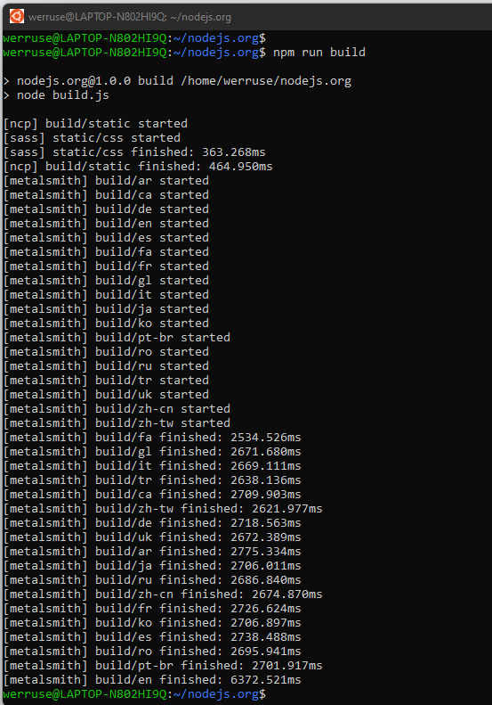
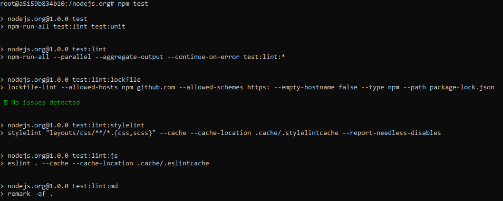
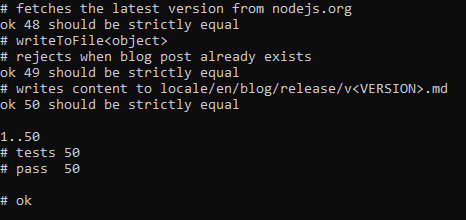
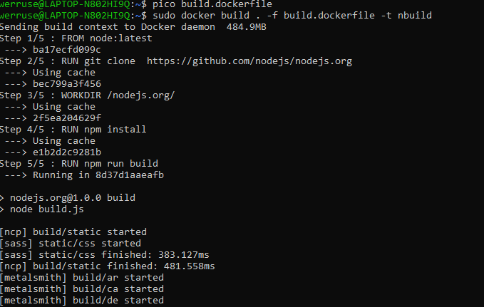
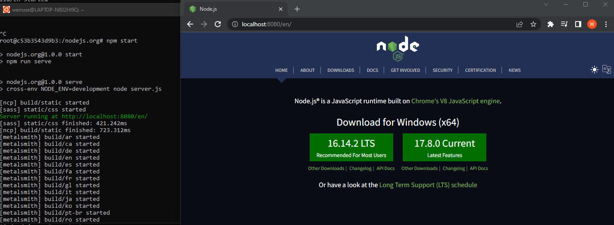

## **LAB3 - Weronika Rusinek - ITE  403038 gr lab 7**

# Punkt 1: Wykonaj kroki build i test wewnątrz wybranego kontenera bazowego.
Wybrano projekt strony nodejs.org: ([https://github.com/nodejs/nodejs.org](https://github.com/nodejs/nodejs.org) - otwarta licencja

Wybrany projekt spełnia wszystkie wymagania postawione w zadaniu: licencja, narzędzia Makefile, testy możliwe do uruchomienia.

- Sklonowanie repozytorium:  `git clone`

- Zainstalowanie zależności z wcześniejszym doinstalowaniem pakietów 

- Zbudowanie projektu: `npm run build`

- Uruchomienie testów:  `npm test`

**Bulid w kontenerze:**
- Uruchamianie: 

- Klonowanie:

- Uruchamianie: 

- Testy: 

# Punkt 2: Stwórz dwa pliki Dockerfile automatyzujące kroki powyżej

**- Kontener pierwszy ma przeprowadzać wszystkie kroki aż do bulida:**

` RUN git clone  https://github.com/nodejs/nodejs.org

WORKDIR /nodejs.org/

RUN npm install

RUN npm build

#EXPOSE 8080 `

**- Kontener drugi bazuje na pierwszym i wykonuje testy:**

` FROM nbuild:latest

WORKDIR /nodejs.org/

RUN npm run build `

# Punkt 3: Wykaż, że kontener wdraża się i pracuje poprawnie

Na poniższym zrzucie przez `-f` możliwość wyboru dockerfile. `-t`wybranie nazwy końcowej obrazu. 
Przedstawiam kolejno wykonane kroki wykazujące działanie dockerfile oraz poprawne wykonanie testów. 

Powstałe obrazy: 

Uruchomienie obrazu: 

