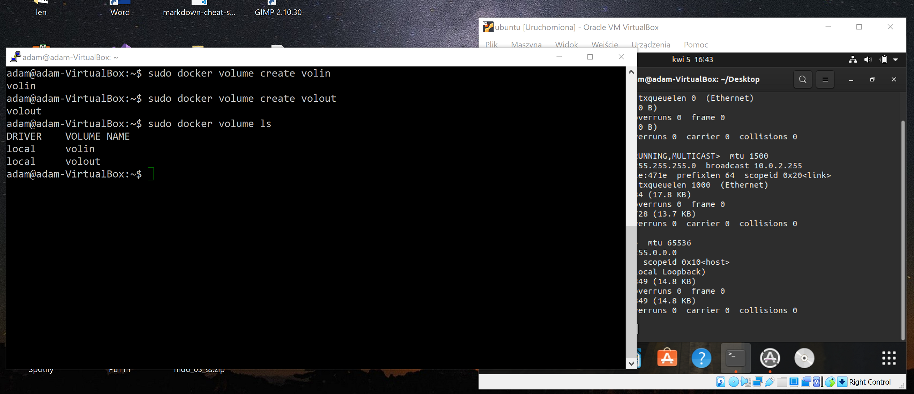
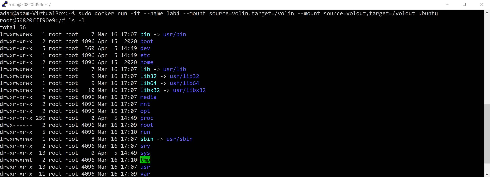
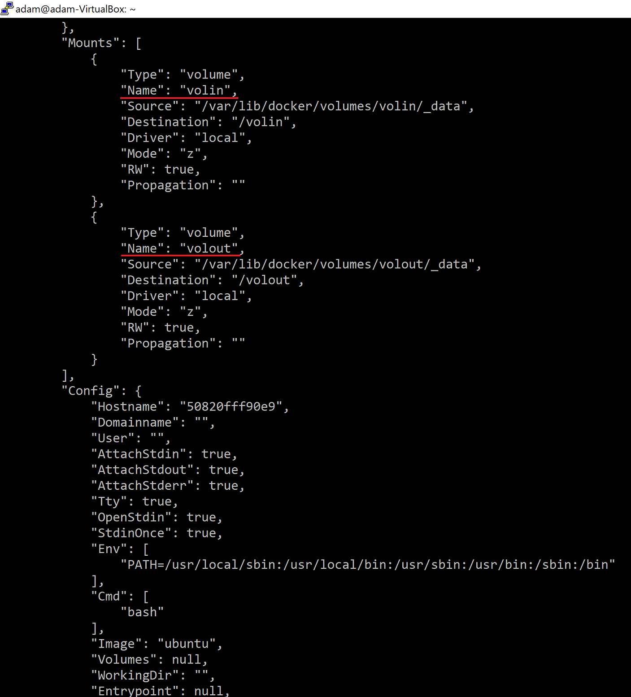
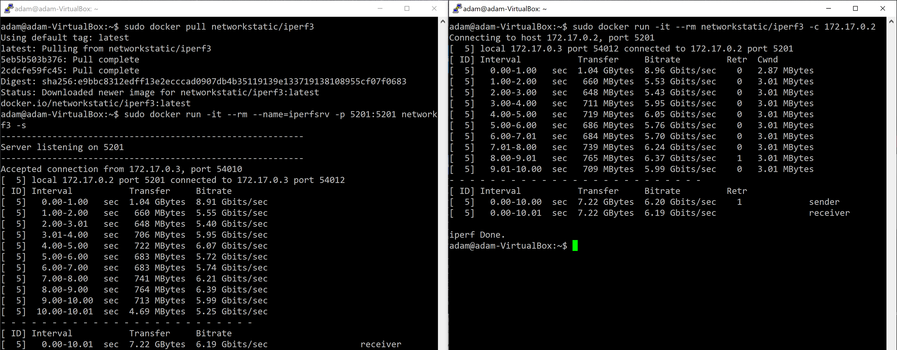
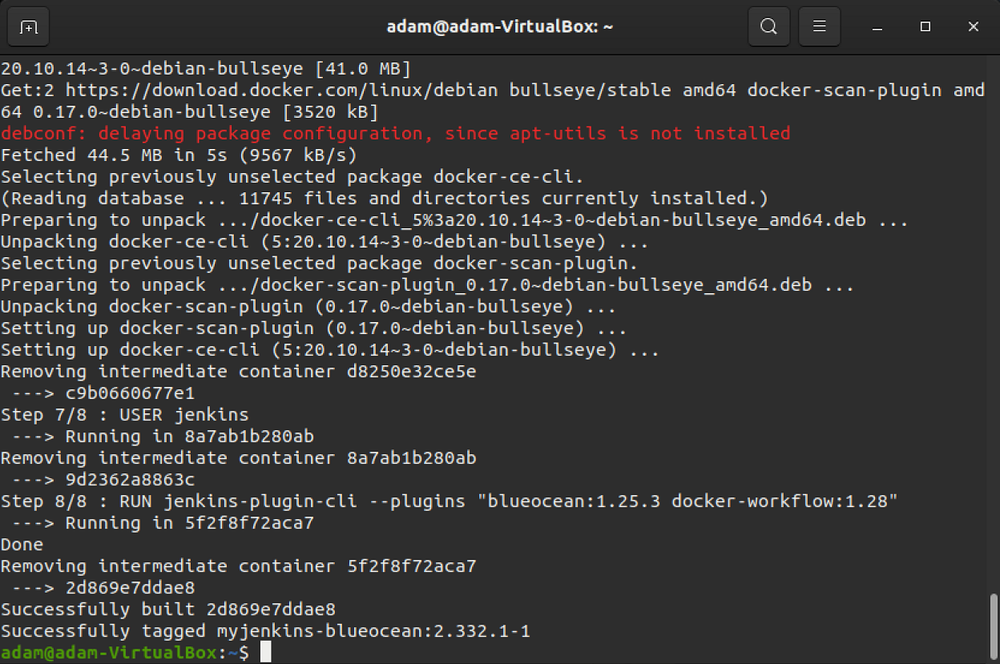
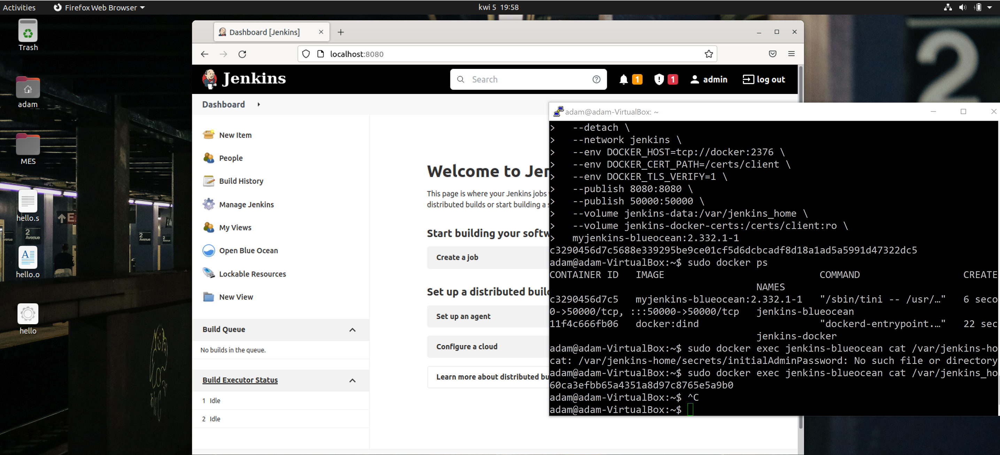

| Imię i nazwisko | Grupa dziekańska | Termin zajęć | Grupa zajęciowa |
| ----------- | ----------- | ----------- | ----------- |
| Adam Głąb | 03 | 30.03.2022r | 08 |

# Sprawozdanie z ćwiczenia laboratoryjnego nr 4


## Zadanie 1

W ramach ćwiczenia wybrano repozytorium [https://github.com/irssi/irssi](https://github.com/irssi/irssi).

- Utworzono wolumin wejściowy `volin` i wyjściowy `volout`:

    - `sudo docker volume create volin`,
    - `sudo docker volume create volout`,



- Wykorzystująć komendę `sudo docker run -it --name lab4 --mount source=volin,target=/volin --mount source=volout,target=/volout ubuntu` uruchomiono kontener z zamontowanymi woluminami,



Podgląd potwierdzający poprawne zamontowanie (`sudo docker inspect lab4`):



- W woluminie wejściowym zainstalowano wszystkie istotne biblioteki i paczki (na podstawie poprzedniego laboratorium, z pominięciem `git`):

    - `apt update`,
    - `apt install meson gcc make automake`,
    - `apt-get install libglib2.0-dev libssl-dev libghc-terminfo-dev`,

- Do woluminu wejściowego sklonowano repozytorium (w sposób zewnętrzny):

    - `sudo -s` -> uruchomienie powłoki,
    - `cd var/lib/docker/volumes/volin/_data` -> przejście do folderu z danymi kontenera,
    - `git clone github.com/irssi/irssi.git` -> sklonowanie repozytorium,


- Wykorzystująć komendę `sudo docker run -it --name irssivols --mount source=volin,target=/volin --mount source=volout,target=/volout ubuntu` utworzono pomocniczy kontener z zamontowanymi woluminami,

- Wewnątrz kontenera zmieniono zmieniono folder na sklonowane repo w woluminie wejściowym `cd volin/irssi`, 

- Repozytorium zbudowano w kontenerze wyjściowym używając komendy `meson build ../../volout/`:


- Zbadano stan woluminu wyjściowego w kontenerze i po zakończeniu pracy:


Proces budowania zakończył się sukcesem.

## Zadanie 2

Wykorzystując komendę `sudo docker pull` pobrano obraz `networkstatic/iperf3`, który odpowiadał za serwer. Na podstawie obrazu uruchomiono kontener komendą `sudo docker run -it --rm --name=iperfsrv -p 5201:5201 networkstatic/iperf3 -s`.

Wykorzystując `sudo docker inspect iperfsrv` znaleziono adres IP kontenera (*172.17.0.2*). Został on wykorzystany w kolejnych etapach zadania.

W równoległym terminalu utworzono połączenie kontener-kontener, wykorzystując polecenie `sudo docker run -it --rm networkstatic/iperf3 -c 172.17.0.2`.



Uzyskano przepustowość **6.19** Gbits/s.

Następnie, utworzono połączenie kontener-host wewnętrzny. Wykorzystano w tym celu komendę `iperf3 -c 172.17.0.2`.


Uzyskano przepustowość **14.6** Gbits/s.

Próby utworzenia połączenia kontener-host zewnętrzny zakończyły się niepowodzeniem. Prawdopodobnie wynikało to z potrzeby utworzenia sieci NAT, która umożliwiała wykonanie tunelowania (ze względu na konieczność pracy na sieci akademickiej). 

Porównując uzyskane wartości przepustowości można zauważyć, że przepustowość kontener-host wewnętrzny było znacznie większa niż w przypadku połączenia kontener-kontener. 

### Zadanie 3

Kierując się oficjalną dokumentacją jenkinsa:

- Utworzono sieć `docker network create jenkins`,

- Pobrano i uruchomiono obraz *DIND*,

```
sudo docker run \
  --name jenkins-docker \
  --rm \
  --detach \
  --privileged \
  --network jenkins \
  --network-alias docker \
  --env DOCKER_TLS_CERTDIR=/certs \
  --volume jenkins-docker-certs:/certs/client \
  --volume jenkins-data:/var/jenkins_home \
  --publish 2376:2376 \
  docker:dind \
  --storage-driver overlay2
```

- Utworzono stosowny `Dockerfile`:

```Dockerfile
FROM jenkins/jenkins:2.332.1-jdk11
USER root
RUN apt-get update && apt-get install -y lsb-release
RUN curl -fsSLo /usr/share/keyrings/docker-archive-keyring.asc \
  https://download.docker.com/linux/debian/gpg
RUN echo "deb [arch=$(dpkg --print-architecture) \
  signed-by=/usr/share/keyrings/docker-archive-keyring.asc] \
  https://download.docker.com/linux/debian \
  $(lsb_release -cs) stable" > /etc/apt/sources.list.d/docker.list
RUN apt-get update && apt-get install -y docker-ce-cli
USER jenkins
RUN jenkins-plugin-cli --plugins "blueocean:1.25.3 docker-workflow:1.28"
```

- Zbudowano nowy obraz `docker build -t myjenkins-blueocean:2.332.1-1 .`,

- Uruchomiono kontener na bazie obrazu:

```
docker run \
  --name jenkins-blueocean \
  --rm \
  --detach \
  --network jenkins \
  --env DOCKER_HOST=tcp://docker:2376 \
  --env DOCKER_CERT_PATH=/certs/client \
  --env DOCKER_TLS_VERIFY=1 \
  --publish 8080:8080 \
  --publish 50000:50000 \
  --volume jenkins-data:/var/jenkins_home \
  --volume jenkins-docker-certs:/certs/client:ro \
  myjenkins-blueocean:2.332.1-1 
```



- Zalogowano się do serwisu. W terminalu widoczne pracujące kontenery.


