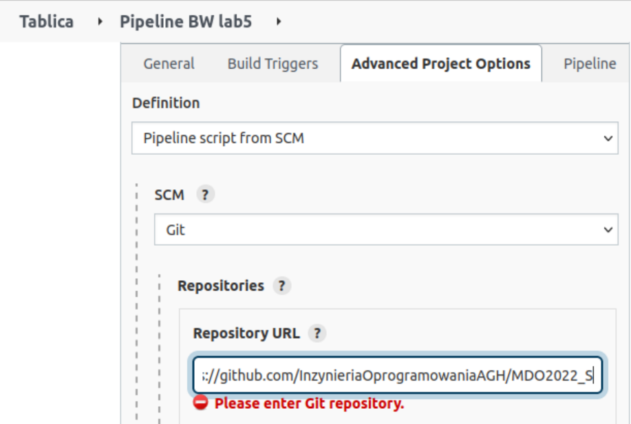

# Projekt pipeline'u
## Lab 05
### 1. Opis projektu<br>
Celem laboratorium było przygotowanie projektu z mozliwoscią automatycznego wykonania czynności wykonanych na poprzednich labolatoriach,
takich jak budowanie i testowanie oraz wdrożenie i publikowanie. W celu wykonania projektu zostaly stworzone dwa pliki Dockerfile. Dockerfile1 
zawiera polecenia potrzebne do sklonowania repozytorium, zainstalowania potrzebnych zależnosci jak i zbudowanie programu. Dockerfile2 zawiera 
polecenia uruchomiające testy przeprowadzone dla wybranego repozytorium. Deploy zostal przeprowadzony wewnątrz kontenera wykorzystując obraz Node. 
W kroku publish ze zbudowanego programu została stworzona paczka tar.tgz.<br>
### 2. Wykonanie projektu<br>
1. Konfiguracja pipeline odbywa się w zakładce "Konfiguracja". Po nadaniu nazwy projektowi w liście rozwijanej Definition należy wybrać ```Pipeline script from SCM```, 
z listy "SCM" wybrać ```Git```, a w URL wpisać link do repozytorium ```https://github.com/InzynieriaOprogramowaniaAGH/MDO2022_S```.<br>

2. W polu "Branch specifier" wpisać ```*/BW402373```, a następnie w "Script Path" wpisać ścieżkę do pliku Jenkinsowego z kodem Pipeline ```ITE/GCL08/BW402373/Lab05/Jenkinsfile```.

3. Pliki potrzebne do przygotowania pipeline<br>
Aby przejść do pisania pipline'u wymagane jest umieszczenie trzech plików dockerfile'owych 
na repozytorium i w branchu dodanym podczas konfiguracji pipeline'u.
Pierwszym z nich jest Dockerfile1 który klonuje repozytorium oraz przeprowadza instalację i budowanie projektu.<br>
```
FROM node:latest

RUN git clone https://github.com/mongo-express/mongo-express.git

WORKDIR mongo-express
RUN npm install
RUN npm run build
```
<br>
Plik Dockerfile2 odpowiada za uruchomienie testów znajdujących się w projekcie.<br>
```
FROM bw_build:latest

WORKDIR mongo-express

RUN npm test
```
<br>


