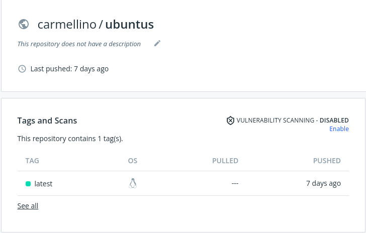
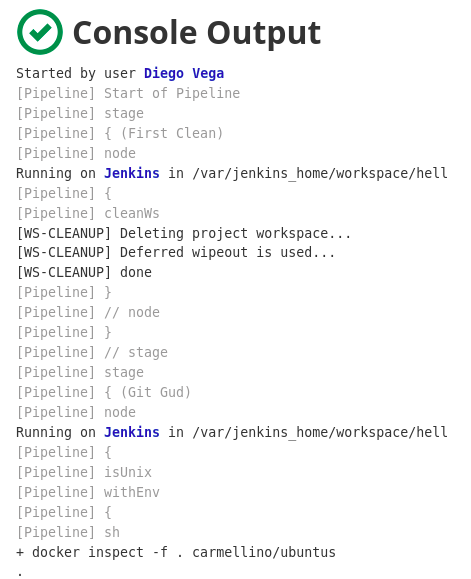
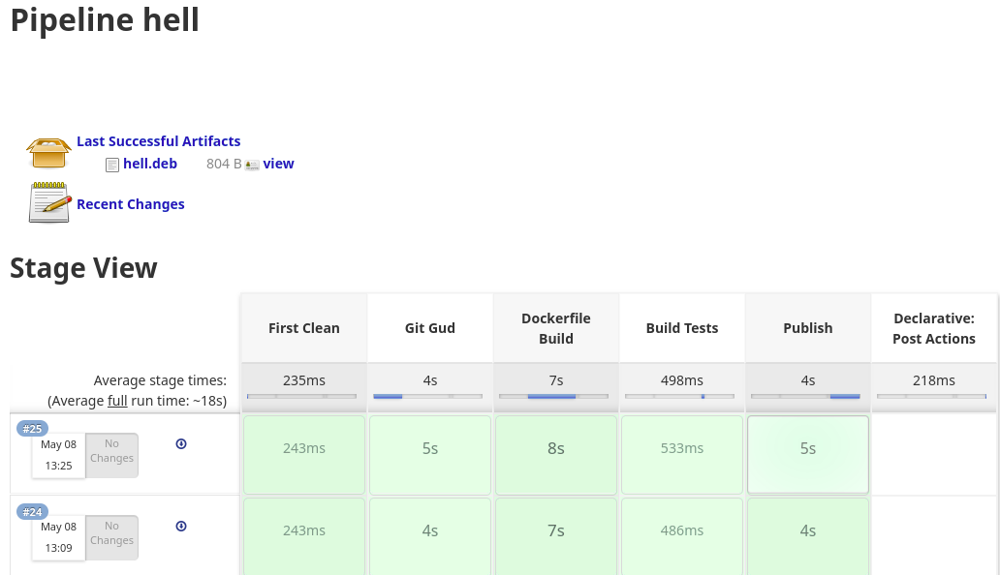

# Wstęp

- Budowanym programem jest prosty program napisany w języku C++ składający się z:
    * pliku bib.h
    ```
    #include <math.h>

    double squareRoot(const double a) 
    {
        double b = sqrt(a);
        if(b != b) 
            return -1.0;
        else
            return sqrt(a);
    }

    ```

    * main.cpp
    ```
    #include<iostream>
    #include"bib.h"
    using namespace std;
    int main()
    {
        cout<<squareRoot(24)<<endl;
        return 0;
    }
    ```

- Program kompilowany jest za pomocą Cmake.
```
cmake_minimum_required(VERSION 2.6)
 
find_package(GTest REQUIRED)
include_directories(${GTEST_INCLUDE_DIRS})
 
add_executable(main main.cpp)
add_executable(runTests tests.cpp)
target_link_libraries(runTests ${GTEST_LIBRARIES} pthread)
```

- Program testowany jest za pomocą Google Test.
```
// tests.cpp
#include "bib.h"
#include <gtest/gtest.h>
 
TEST(SquareRootTest, PositiveNos) { 
    ASSERT_EQ(6, squareRoot(36.0));
    ASSERT_EQ(18.0, squareRoot(324.0));
    ASSERT_EQ(25.4, squareRoot(645.16));
    ASSERT_EQ(0, squareRoot(0.0));
}
 
TEST(SquareRootTest, NegativeNos) {
    ASSERT_EQ(-1.0, squareRoot(-15.0));
    ASSERT_EQ(-1.0, squareRoot(-0.2));
}
 
int main(int argc, char **argv) {
    testing::InitGoogleTest(&argc, argv);
    return RUN_ALL_TESTS();
}
```

- Program przeznaczony jest do systemu Linux Ubuntu.

- Założonym artefaktem, który ma zostać uzyskany jest plik .deb służący do instalacji programu.

- Założoną lokalizacją, w której ma znaleźć się zainstalowany program jest /home/user/hell/

# Podjęte Kroki

- Utworzono obraz "carmellino/ubuntus" za pomocą dockerfile'a:
```
FROM ubuntu:latest
RUN apt-get update -y
RUN apt-get install git -y
```
Obraz ten będzie odpowiedzialny za pobranie programu, dockerfile’a instalującego dependencje
potrzebne do zbudowania programu oraz pliku control.

- Połączono dockera z dockerhubem za pomocą komendy:
`sudo docker login -u carmellino`
A następnie Przesłano utworzony obraz na dockerhub za pomocą komendy:
`docker push carmellino/ubuntus`



- Utworzono dockerfile'a o treści:
```
FROM ubuntu:latest
RUN apt-get update -y
RUN apt-get install git -y
ENV TZ=Europe/Warsaw
RUN ln -snf /usr/share/zoneinfo/$TZ /etc/localtime && echo $TZ > /etc/timezone
RUN apt-get install cmake -y
RUN apt-get install g++ -y
RUN apt-get install libgtest-dev -y
WORKDIR "/usr/src/gtest"
RUN cmake CMakeLists.txt
RUN make
RUN cp lib/libgtest.a /usr/lib
RUN cp lib/libgtest_main.a /usr/lib
WORKDIR "/"
```
Następnie przesłano go do repozytorium programu.
Dockerfile ten odpowiedzialny będzie za stworzenie środowiska do zbudowania programu.

- Utworzono plik control o treści:
```
Package: hell
Version: 0.2
Maintainer: King Foo
Architecture: all
Description: hellhellhell
```
Następnie przesłano go do repozytorium programu. Plik control jest potrzebny do zbudowania pliku .deb.

- Utworzono nowy pipeline w jenkinsie ze skryptem:
```
pipeline
{
    agent none
    stages
    {
        stage('First Clean')
        {
            agent any
            steps{
                cleanWs()
            }
        }
        stage('Git Gud') 
        {
            agent 
            {
                docker 
                {
                    image 'carmellino/ubuntus' 
                    args '-u root:sudo'
                }
            }
            steps 
            {
                sh 'ls'
                sh 'git clone https://github.com/carmellino/naDevOps.git'
                sh 'mv naDevOps/Dockerfile Dockerfile'
            }
        }
        stage('Dockerfile Build')
        {
            agent {dockerfile{filename 'Dockerfile' args '-u root:sudo'}}
            steps
            {
                sh 'mkdir build'
                sh 'cp naDevOps/* build'
                sh '(cd build;cmake CMakeLists.txt;make;)'
            }
        }
        stage('Build Tests')
        {
            agent any
            steps
            {
                sh '(cd build;./runTests)'
            }
        }
        stage('Publish')
        {
            agent {docker {image 'ubuntu' 
            args '-u root:sudo'}}
            steps
            {
                sh 'mkdir hell && mkdir hell/DEBIAN'
                sh 'mkdir hell/home'
                sh 'mkdir hell/home/user'
                sh 'mkdir hell/home/user/hell'
                sh 'cp build/main hell/home/user/hell/hell'
                sh 'cp naDevOps/control hell/DEBIAN/control'
                sh 'dpkg-deb --build hell'
                archiveArtifacts artifacts: 'hell.deb', fingerprint: true
            }
        }
    }
}
```

    * Stage "First Clean" odpowiedzialny jest za czyszczenie workspace'a przed rozpoczęciem budowania.
    * o Stage "Git Gud" odpowiedzialny jest za sklonowanie repozytorium zawierającego program, dockerfile'a oraz pliku control.
    * Stage "Dockerfile Build" tworzy kontener ze środowiskiem wymaganym do zbudowania programu.
    * Stage "Build Test" odpowiedzialny jest za testowanie działania zbudowanego programu.
    * Stage "Publish" tworzy plik .deb, a następnie zapisuje go jako artefakt.



Otrzymany artefakt:


- Pobrano otrzymany artefakt na system ubuntu i zainstalowano go za pomocą komendy:
`sudo dpkg –i Downloads/hell.deb`


- Sprawdzono poprawną instalację programu:


Program został zainstalowany w założonej lokalizacji i działa poprawnie.


0. Wstęp
Budowanym programem jest prosty program napisany przeze mnie.
Program przeznaczony jest do systemu Linux Ubuntu.
Założonym artefaktem który ma zostać uzyskany jest plik .deb służący do instalacji programu.
Założoną lokalizają w której ma znaleźć się zainstalowany program jest /home/user/hell/

1. Utworzono obraz "carmellino/ubuntus" za pomocą dockerfile'a:

Obraz ten będzie odpowiedzialny za pobranie programu, dockerfile oraz pliku control.

3. Połączono dockera z dockerhubem za pomocą komendy:
sudo docker login -u carmellino

2. Przesłano utworzony obraz na dockerhub za pomocą komendy:
docker push carmellino/ubuntus

3. Utworzono dockerfile'a o treści:
```
FROM ubuntu:latest
RUN apt-get update -y
RUN apt-get install git -y
ENV TZ=Europe/Warsaw
RUN ln -snf /usr/share/zoneinfo/$TZ /etc/localtime && echo $TZ > /etc/timezone
RUN apt-get install cmake -y
RUN apt-get install g++ -y
RUN apt-get install libgtest-dev -y
WORKDIR "/usr/src/gtest"
RUN cmake CMakeLists.txt
RUN make
RUN cp lib/libgtest.a /usr/lib
RUN cp lib/libgtest_main.a /usr/lib
WORKDIR "/"
```
Dockerfile odpowiedzialny będzie za stworzenie środowiska w którym budowany będzie program.
Początkowo środowisko miało być częścią obrazu pobieranego z dockerhub, jednak pojawiały się błędy przy używaniu komendy cmake. Jest to problem którego niestety nie udało mi się rozwiązać.

4. Utworzonego dockerfile dodano do repozytorium git programu

5. Utworzono plik control o treści:
```
Package: hell
Version: 0.2
Maintainer: King Foo
Architecture: all
Description: hellhellhellhell
```
A następnie dodano go do repozytorium
Plik ten jest potrzebny do zbudowania pliku .deb.

6. utworzono nowy pipeline w jenkinsie ze skryptem:
```
pipeline
{
    agent none
    stages
    {
        stage('First Clean')
        {
            agent any
            steps{
                cleanWs()
            }
        }
        stage('Git Gud') 
        {
            agent 
            {
                docker 
                {
                    image 'carmellino/ubuntus' 
                    args '-u root:sudo'
                }
            }
            steps 
            {
                sh 'ls'
                sh 'git clone https://github.com/carmellino/naDevOps.git'
                sh 'mv naDevOps/Dockerfile Dockerfile'
            }
        }
        stage('Dockerfile Build')
        {
            agent {dockerfile{filename 'Dockerfile' args '-u root:sudo'}}
            steps
            {
                sh 'mkdir build'
                sh 'cp naDevOps/* build'
                sh '(cd build;cmake CMakeLists.txt;make;)'
            }
        }
        stage('Build Tests')
        {
            agent any
            steps
            {
                sh '(cd build;./runTests)'
            }
        }
        stage('Publish')
        {
            agent {docker {image 'ubuntu' 
            args '-u root:sudo'}}
            steps
            {
                sh 'mkdir hell && mkdir hell/DEBIAN'
                sh 'mkdir hell/home'
                sh 'mkdir hell/home/user'
                sh 'mkdir hell/home/user/hell'
                sh 'cp build/main.cpp hell/home/user/hell/hell.cpp'
                sh 'cp naDevOps/control hell/DEBIAN/control'
                sh 'dpkg-deb --build hell'
                archiveArtifacts artifacts: 'hell.deb', fingerprint: true
            }
        }
    }
}
```

- Stage "First Clean" odpowiedzialny jest za czyszczenie workspace'a przed rozpoczęciem budowania.

- Stage "Git Gud" odpowiedzialny jest za sklonowanie repozytorium zawierającego program, dockerfile'a oraz pliku control.

- Stage "Dockerfile Build" tworzy kontener ze środowiskiem wymaganym do zbudowania programu.

- Stage "Build Test" odpowiedzialny jest za testowanie działania zbudowanego programu.

- Stage "Publish" tworzy plik .deb, a następnie zapisuje go jako artefakt.


7. Dowody:

Obraz na dockerhub

Pipeline:

Artefakt:


