# Instalacja Fedory

- Ze strony [getfedora.org](https://getfedora.org/en/server/download/?msclkid=bf9cf71bcbb711ecb80edcc952ba9f18) Pobrano plik .iso do instalacji systemu Fedora 36 w wersji netinstall.

- utworzono dwie maszyny wirtualne (FedoraS (Serwer) i FedoraK (Klient)) i przydzielono im po 20GB pamięci stałej. Zamontowano również w nich obraz i ustawiono sieć na mostkowaną.

- uruchomiono maszynę FedoraS i przeprowadzono instalację
    - 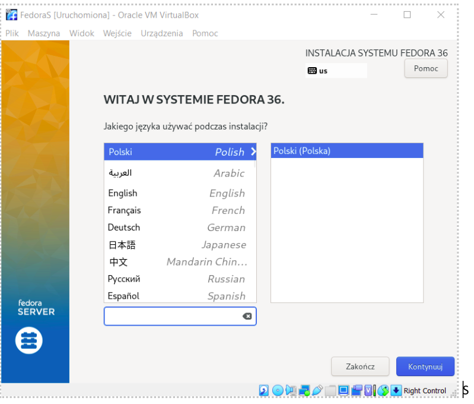
    - 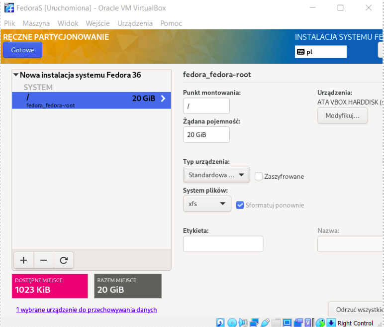
    - 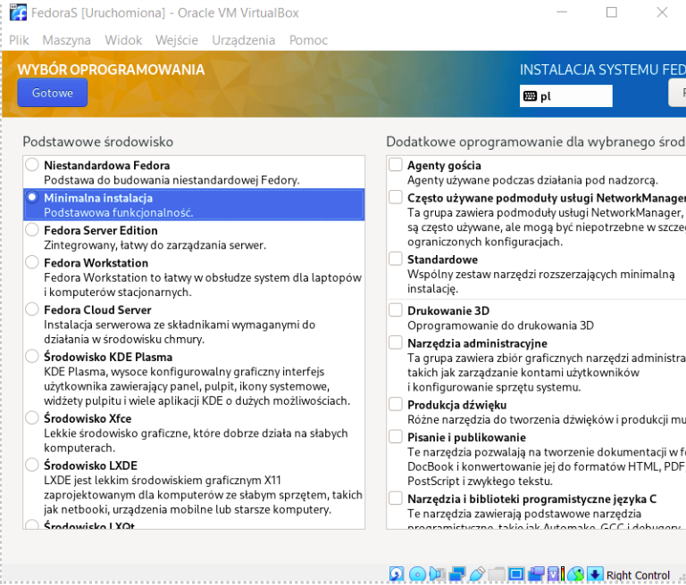
    - 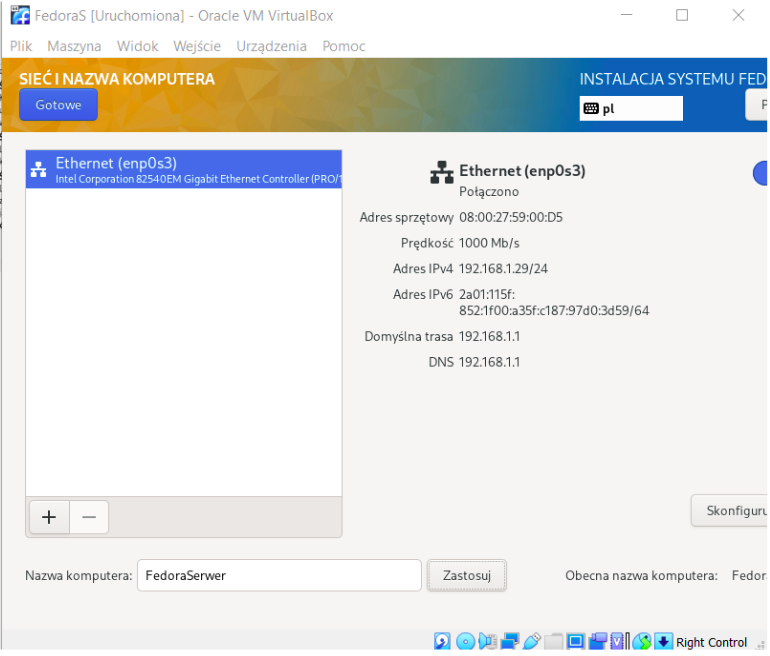
    - 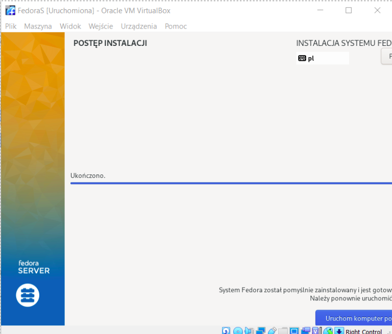

- po zakończeniu instalacji wyłączono maszynę, zmieniono ustawienia uruchamiania tak, aby po uruchomieniu maszyny system nie próbował sie znów instalować

- uruchomiono maszynę ponownie żeby sprawdzić poprawność insalacji
    

- uruchomiono maszynę FedoraK i przeprowadzono instalacje tak jak poprzednio z jedną różnicą
    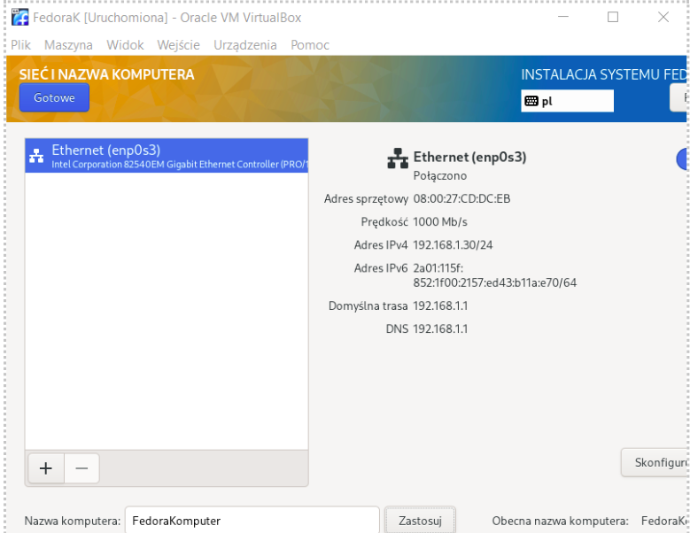

- wyłączono maszynę i zmieniono ustawienia uruchamiania

- uruchomiono maszynę żeby sprawdzić poprawność instalacji
    

# Pobranie pliku konfiguracyjnego

- W maszynie FedoraS uruchomiono polecenie `ip a`
    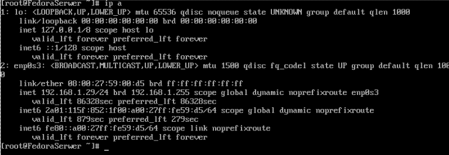

- uruchomiono Filezille i połączono się za jej pomocą z maszyną i pobrano plik anacondaks.cfg
    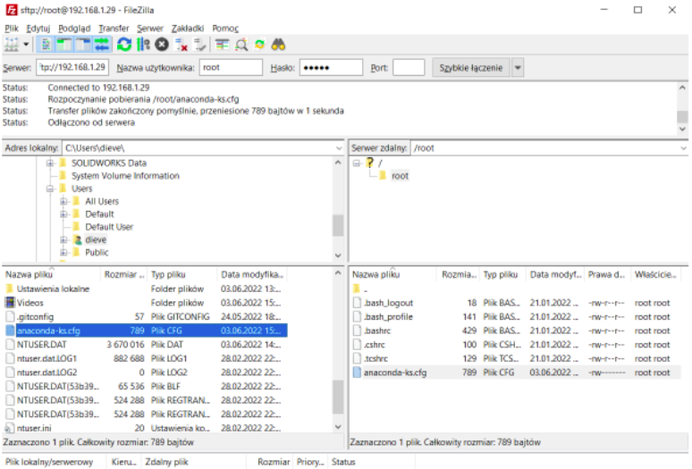

# Ustawienie serwera

- Pobrano artefakt uzyskany w poprzednich laboratoriach, w tym wypadku plik hell.deb

- za pomocą Filezilli przesłano go do Maszyny FedoraS
    
    

- Na maszynie FedoraS zainstalowano pakiet httpd za pomocą komendy `dnf install httpd`
    

- Dodano potrzebne wyjątki do firewall'a i przeładowano go
    

- uruchomiono usługę httpd
    

- utworzono folder /var/www/html/hello, nadano mu odpowiednie uprawnienia i skopiowano do niego plik hell.deb
    

# Ustawienie klienta

- Na maszynie FedoraK zainstalowano pakiet wget za pomocą polecenia `dnf install wget`
    

- Na FedoraS i FedoraK uruchomiono polecenie `firewall-cmd --add-port=80/tcp`

- Pobrano z serwera plik hell.deb
    

- Zainstalowano pakiet alien za pomocą komendy `dnf install alien`
    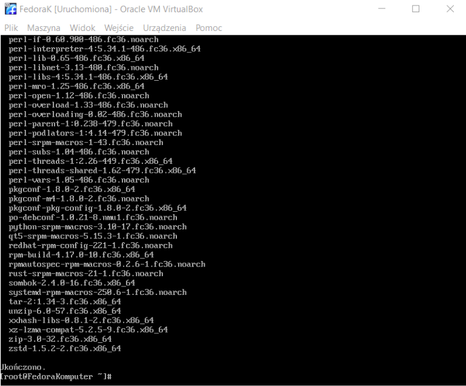
    

- podjęto próbę stworzenia instalacyjnego .rpm na podstawie pliku hell.deb za pomocą komendy `alien --to-rpm hell.deb`. Próba niestety nie powiodła się
    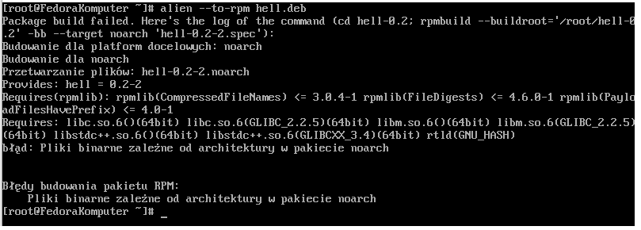

- zmieniono linię `Architecture: all` na `Architecture amd64` a pliku control i zbudowano plik instalacyjny jeszcze raz. Dla pewności z powodzeniem zainstalowano za jego pomocą program w systemie Ubuntu

- plik zbudowany na nowo znów przesłano do serwera i pobrano go z tamtąd przez klienta.

- ponowiono próbę zainstalowania programu, znów z niepowodzeniem, ale innym błędem
    
    Po wpisaniu polecenia `file hell.deb` okazało się że plik jest pusty, więc zbudowano go, przesłano i pobrano jeszcze raz, przy okazji zmieniając jego nazwę z hell.deb na hell-0.1-1_amd64.deb. 

- Po upewnieniu się że plik nie jest tym razem pusty ponowiono próbę instalacji która znów zakończyła się niepowodzeniem
    

- 


# Instalacja nienadzorowana

- Zmieniono zawartość wcześniej pobranego pliku anaconda-ks.cfg
    ```
    ANACONDAAA
    ```

- plik umieszczono w reozytorium na gitHub

- Utworzono nową maszynę wirtualną FedoraKlientNieNadzorowany o takich samych cechach jak poprzednie

- Uruchomiono maszynę i w menu instalacyjnym przyciśnięto przycisk tab.
    
- do komendy `mlinuz initrd=initrd.img inst.stage2=hd:LABEL=Fedora-S-dvd-x86_64-36 rd.live.check quiet` która została wyświetlona dopisano ` inst.ks=https://raw.githubusercontent.com/InzynieriaOprogramowaniaAGH/MDO2022_S/DV404273/ITE/GCL08/DV404273/Lab09/anaconda-ks.cfg` i wciśnięto Enter
    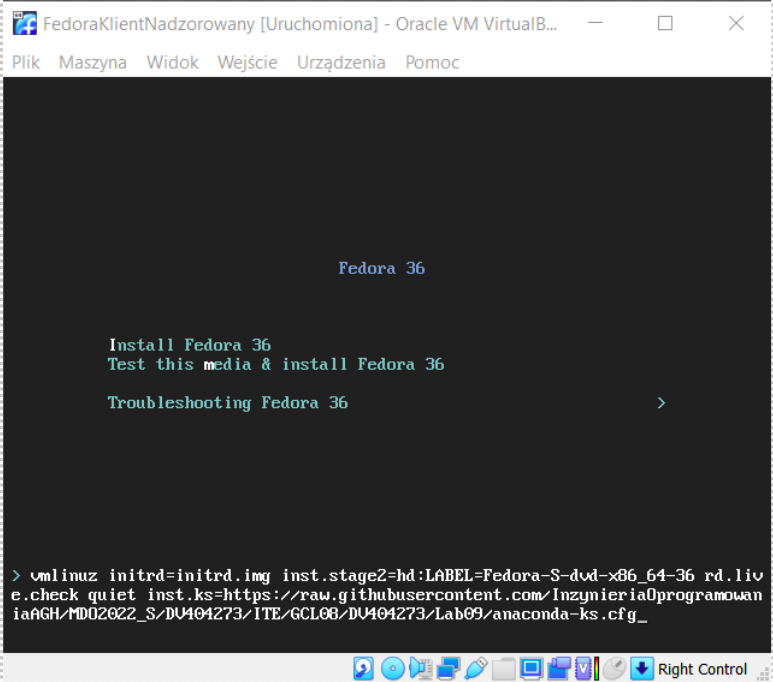
    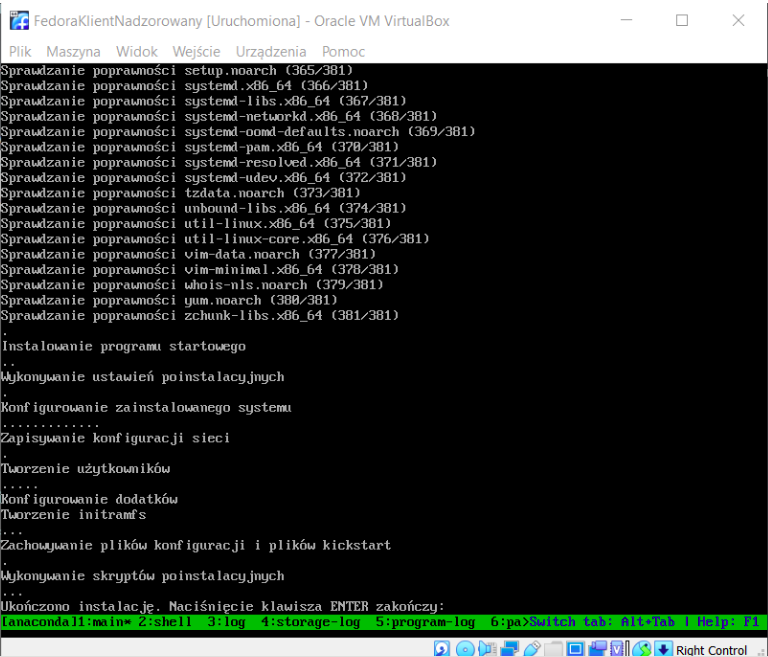


- po zakończeniu instalacji przyciśnięto Enter, a gdy pojwiło się menu instalacyjne wyłączono maszynę

- ponownie zmieniono ustawienia uruchamiania maszyny, po czym uruchomiono maszynę

- sprawdzono poprawność instalacji i pobrania pakietu z serwera
    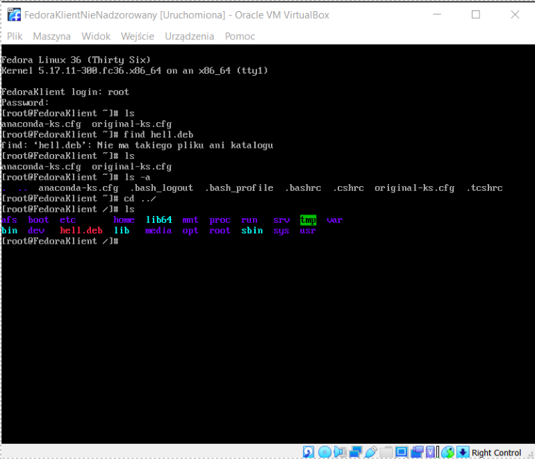

# Infrastructure as code

- upewniono się że na najnowszej maszynie został zamontowany obraz Fedory na napędzie optycznym
    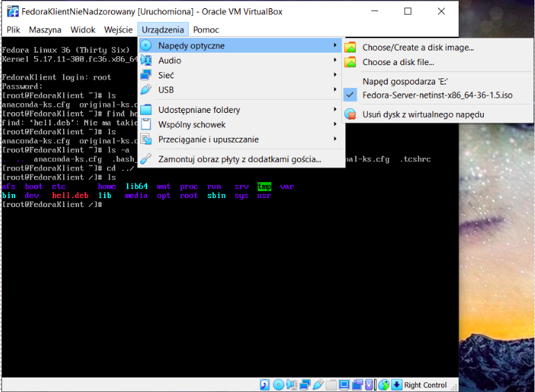

- Utworzono katalog /media/iso/ i zamontowano w nim obraz z napędu za za pomocą komendy `mount /dev/sr0 media/iso`
    
    

- Skopiowano plik plik anaconda-ks.cfg do obrazu
    

- Do pliku isolinux.cfd dodano `inst.ks=cdrom:/isolinux/ks.cfg`
    

- Zainstalowano pakiet genisoimage za pomocą komendy `dnf install genisoimage`
    

- Utworzono iso
    
    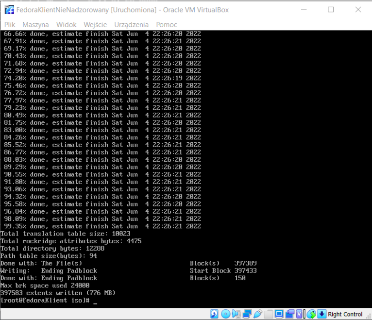
    


