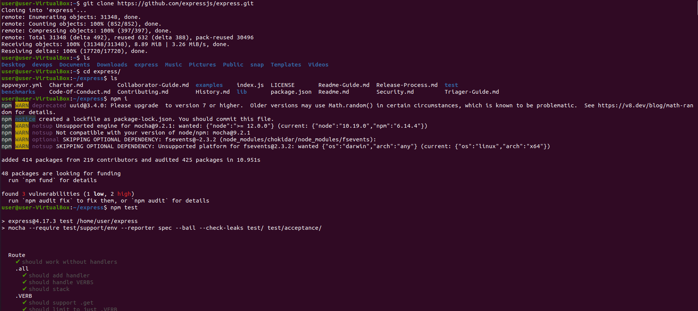
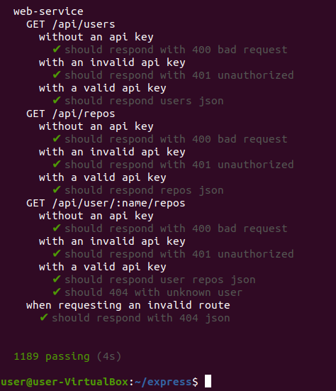
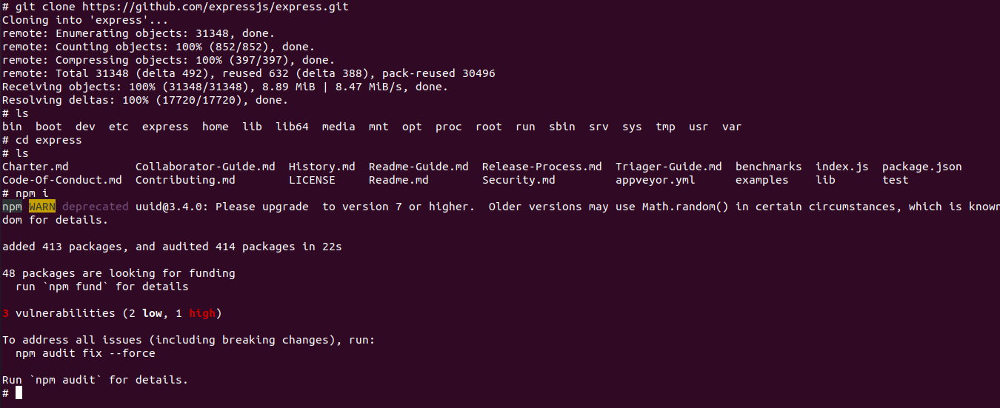
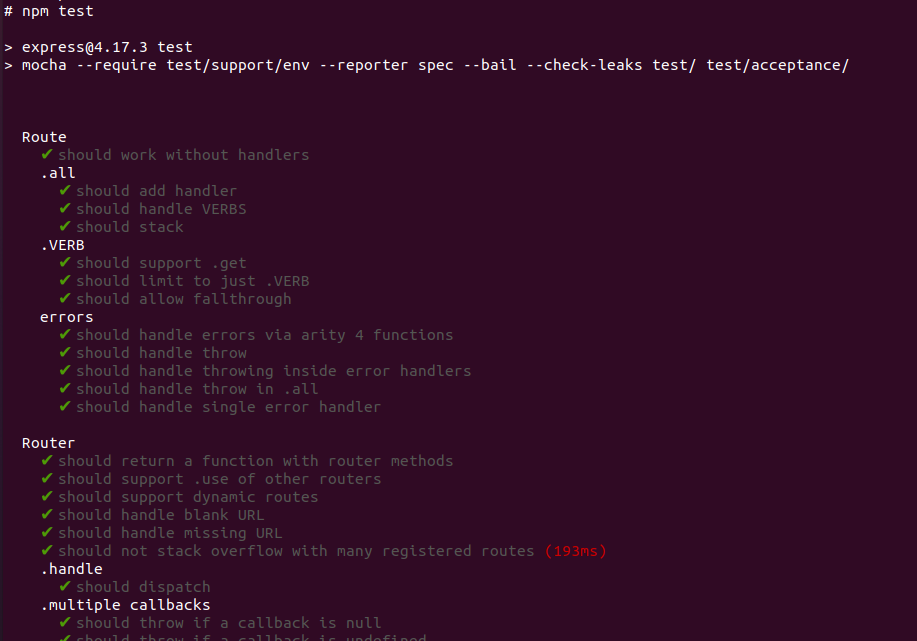
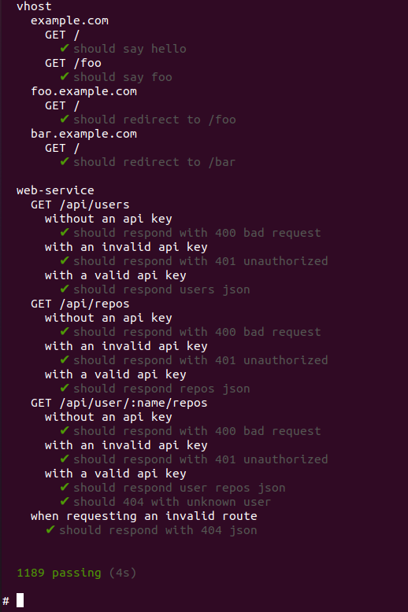
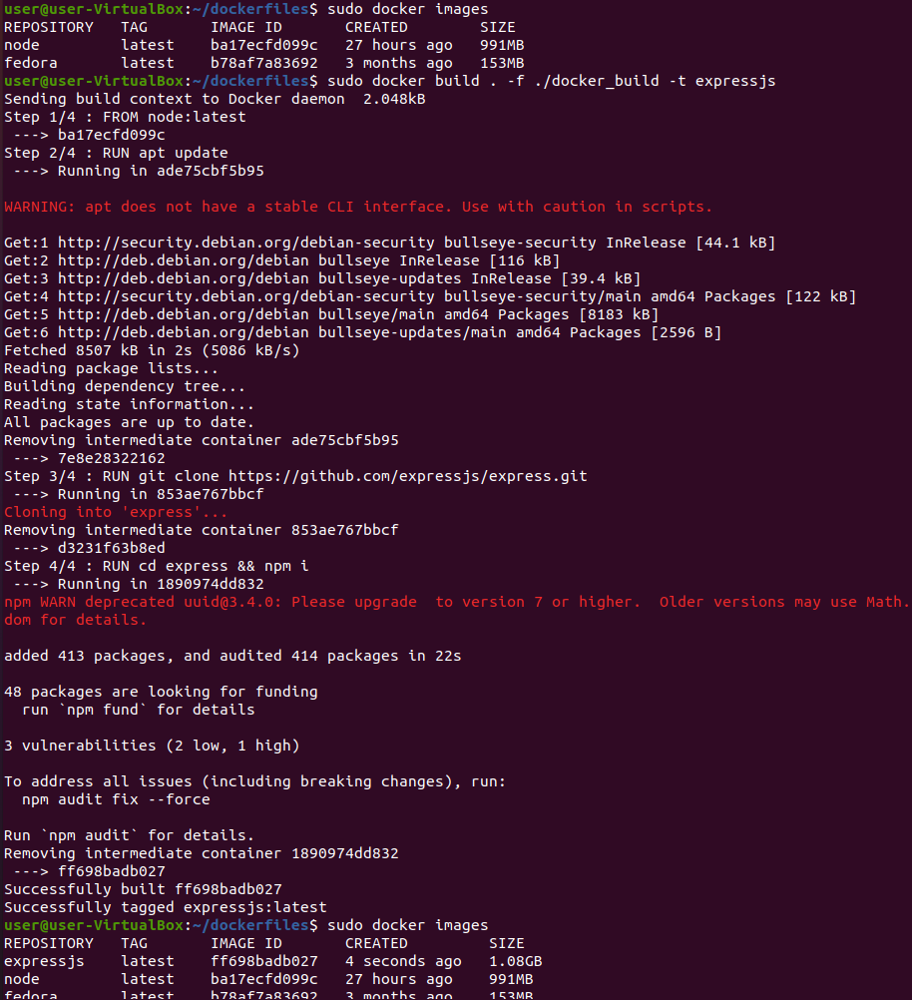
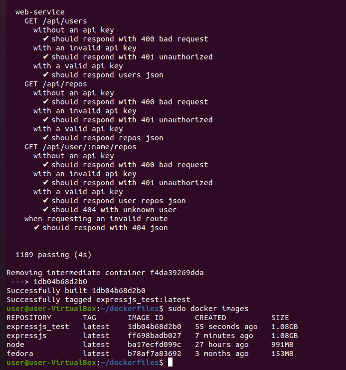

# Sprawozdanie Lab03 Damian Zyznar ITE-GCL08

1. Znalezienie open-source'owego projektu niezbędnego do wykonania laboratorium. 

Środowiskiem Makefile jest tu npm. 
 
 Link do repo:
 ```https://github.com/cytoscape/cytoscape.git```

2. Sklonowanie repozytorium i jego zbudownie za pomocą npm.



Udowodnienie przejścia builda przez testy.



3. Obraz ```node``` został już wcześniej pobrany, udowodnienie jego istnienia.


4. Uruchomienie kontenera z obrazem node i podłączenie się do niego TTY. Sprawdzenie instnienia wymaganych aplikacji do zbudowania projektu.


Git i npm są zainstalowane, więc przystępuję do sklonowania repozytorium i do zbudowania projektu.



Uruchomienie testów.





5. Przystąpienie do utworzenia obrazu przy pomocy Dockerfile.



Kod Dockerdile do builda obrazu:
```
FROM node:latest

RUN apt update
RUN git clone https://github.com/expressjs/express.git
RUN cd express && npm i
```

6. Przystąpienie do utworzenia obrazu, który bazuje na wczesniej utworzonym i wykonuje testu.



Kod Dockerdile do builda obrazu:
```
FROM expressjs:latest

RUN cd express && npm test
```

7. Sprawdzenie poprawności działania utworzonych wczesniej obrazów.


# Co pracuje w kontenerze utworzonym przez nas?
W kontenerze pracuje program w środowisku odizolowanym od nadrzędnego systemu.

Obraz jest podstawą do utworzenia kontenera.