# Metodyki devops - Wdrażanie na zarządzalne kontenery: Kubernetes cz. 1 i 2

## Wykonanie laboratorium:

# **Część 1: Instalacja klastra Kubernetes**
W pierwszej części należało przygotować środowisko. Zaopatrzyć się w implementacje stosu k8s: minikube oraz polecenie kubectl.

Przed instalacją należało także doinstalować `curl`. Po instalacji, możliwe było przejście do dalszych kroków.

- instalacja stosu minikube.


- uruchomienie minikube'a.


Przy pierwszej próbie uruchomienia pojawił się problem, minikube się nie uruchomił poprawnie, ponieważ pojawił się problem z Dockerem, konkretnie z dodaniem użytkownika do grupy. Poniższy screen przedstawia wykonanie zaleconego polecenia i poprawne uruchomienie stosu. 


- pobranie pakietów zaopatrujących w polecenie kubectl i sprawdzenie sumy kontrolnej, w celu wykazania wiarygodności bezpieczeństwa instalacji i następnie zainstalowano.


- pokazanie działających node'ów i podów (pokazanie działającego workera, czyli node'a). 

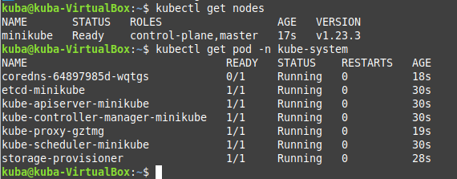

- urochomienie dashboardu w przeglądarce i pokazanie łączności.


- co do wymagań sprzętowych zawartych w dokumentacji są przedstawione na pożniszym screenie.


Jak można zauważyć nie na każdym komputerze możliwa jest instalacja minikube. W moim przypadku największy problem stanowiło 20GB wolnej przestrzeni w VM, co zmusiło mnie to powiększenia przydzielonej przestrzeni na dysku. Na kalkulatorze również nie jest możliwe uruchomienie, ponieważ w wymaganiach zawarta jest informacja o co najmniej 2 wymaganych rdzeniach w CPU. Co prawda większość nowych procesorów nie schodzi poniżej standardów 4 rdzenie - 8 wątków, lecz na starszym sprzęcie może pojawiać się ten problem. Wyamga także połączenia z środowiskiem konteneryzacji np Dockerem. W moim przypadku na początku semstru, przy tworzeniu VM przydzieliłem jej 50GB pamięci, 4GB RAMu oraz 2 rdzenie, więc wymagania były spełnione.

- w dalszej części zapoznałem się z 
koncepcjami funkcji wyprowadzanych przez kubernetesa. Przykładowo `pod` stanowi najmniejszą jednostke obliczeniową, które można tworzyć i zarządzać w kubernetesie (grupa kontenerów ze współdzielonymi pamięci masowej i sieciowej).

# **Część 2: Analiza posiadanego kontenera**

Do wykonania tego punktu konieczna była zmiana poprzedniej aplikacji (cytoscape), ponieważ nie wyprowadzała żadnych portów. Wybrałem nową aplikacje, która wyprowadzała port. W poniższych krokach jest zaprezentowana.

- utworzenie katalogu i clone nowej aplikacji

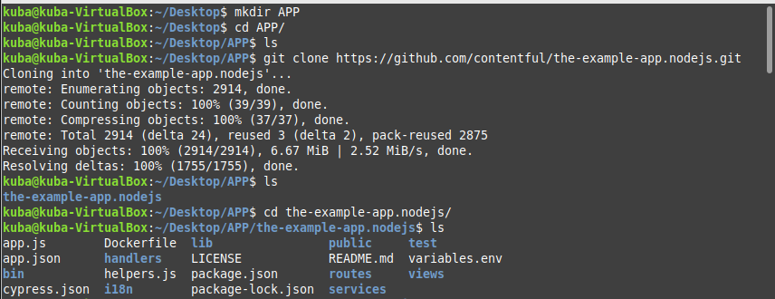

Wybrana aplikacja zawierała gotowy Dockerfile do zbudowania obrazu.

```
FROM node:latest

WORKDIR /app

RUN npm install -g contentful-cli

COPY package.json .
RUN npm install

COPY . .

USER node
EXPOSE 3000

CMD ["npm", "run", "start:dev"]
```

- budowa obrazu nowej aplikacji


- odpalenie kontenera z udostępnionym portem, przekierowanie portu z kontenera na localhost:3200.


- wykazanie porawności działania aplikacji

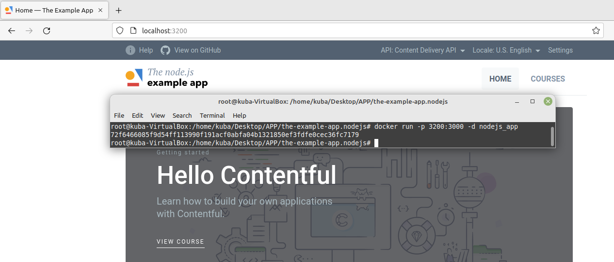

# **Część 3: Uruchamianie oprogramowania**

- utworzenie pliku definicji pod dla wybranej aplikacji

```
apiVersion: v1
kind: Pod
metadata:
  name: myapp
  labels:
    app: example
spec:
  containers:
    - name: example
      image: nodejs_app
      imagePullPolicy: Never
      ports:
      - containerPort: 3200
```

Przy próbie utworzenia poda (apply) pojawia się błąd, ponieważ obraz jest utworzony w Dockerze lokalnym, a nie w kubernetesie.


 `imagePullPolicy: Never` powoduje, że obraz nie będzie zaciągany z internetu, tylko jest poszukwany lokalnie w danym nodzie. 

Tutaj z pomocą przychodzi polecenie `eval $(minikube docker-env)`.


Naprawa błędu:


 Polecenie minikube docker-env zwraca zestaw eksportów zmiennych środowiskowych Basha, służących do skonfigurowania lokalnego środowiska w celu ponownego użycia demona Dockera wewnątrz instancji Minikube. Przekazanie tego wyjścia przez eval powoduje, że bash oceni te eksporty i wprowadzi je w życie.

Umożliwia to poprawę doświadczenia użytkownika w budowaniu i uruchamianiu obrazów Dockera, które można uruchamiać w środowisku minikube.

Poprawne działanie polecenia i obrazów w klastrze.


Utworzenie obrazu w node na podstawie tego samego Dockerfile.


Ponowne, tym razem poprawne, utworzenie poda i przedstawienie działania na dashboardzie.


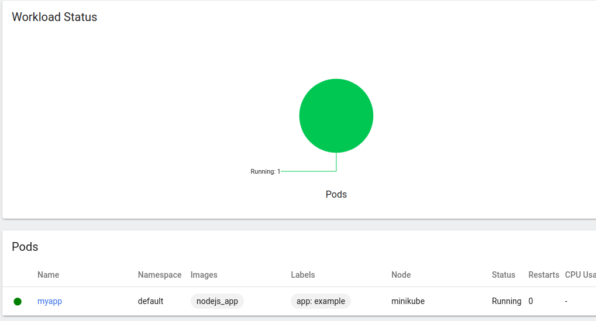

Wyprowadzenie portu w celu dotarcia do eksponowanej funkcjonalności.


# **Część 4: Przekucie wdrożenia manualnego w plik wdrożenia**

Utworzenie nowego pliku definicji do wdrożenia, zawierającego dodane replik. 

```
apiVersion: apps/v1
kind: Deployment
metadata:
  name: myapp
  labels:
    app: example
spec:
  replicas: 3
  selector:
    matchLabels:
      app: example
  template:
    metadata:
      labels:
        app: example
    spec:
      containers:
        - name: myapp
          image: nodejs_app
          imagePullPolicy: Never
          ports:
          - containerPort: 3200
```


Wykazanie działania na dashboardzie:

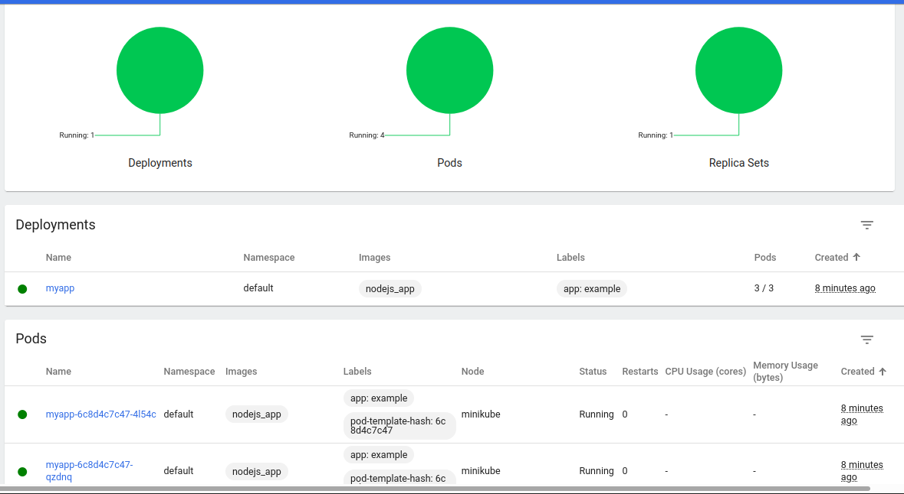

# **LAB12**
# **Część 5: Konwersja wdrożenia ręcznego na wdrożenie deklaratywne YML**
W posiadanym z poprzednich zajęć pliku `pod2.yml` zmodyfikowałem ilość replik na 4.

```
spec:
  replicas: 4
```

Następnie rozpoczynam wdrożenie poleceniem `kubectl apply` oraz badam jego stan za pomocą polecenia `kubectl rollout status`.


Przedstawienie poprawności działania na daschboardzie - jak można zauważyć utworzone zostały 4 pody.

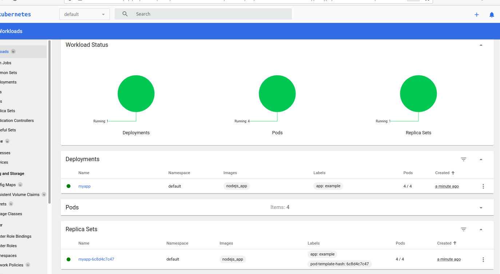


# **Część 6: Przygotowanie nowego obrazu**
Na początek zalogowałem się na swoje konto na maszynie.


Do wdrożenia przygotowałem dwa obrazy, które zostaną zpushowane na Dockerhuba do swojego repozytorium.

Pierwszy obraz z tagiem modified, który jest zwyczajnym obrazem aplikacji, można go nazwać "latest".

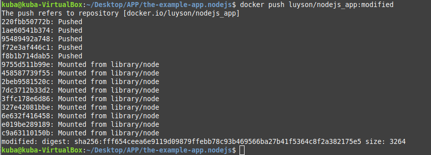

Drugi obraz z tagiem failed nie zawiera kluczowych skryptów do uruchomienia aplikacji.

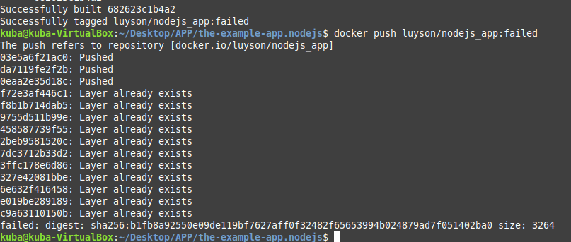

Próba uruchomienia lokalnie kontenera na podstawie tego obrazu, jak widać nieudana.


Wyświetlenie spushowanych obrazów na Dockerhubie:

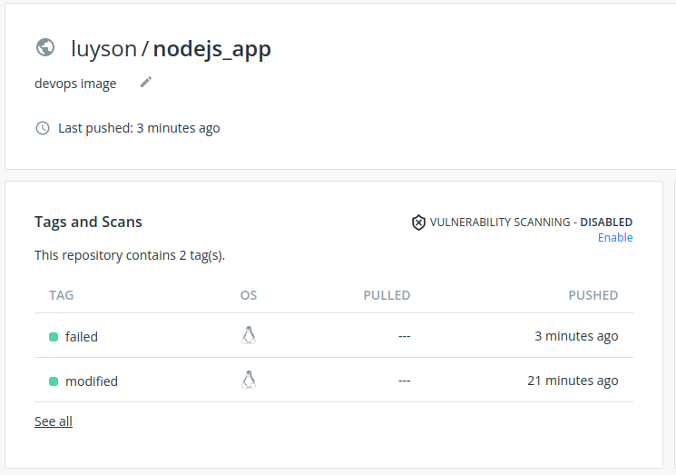

# **Część 7: Zmiany w deploymencie**
Ta cześć polegała na aktualizowaniu pliku yml i obserwowaniu zachodzących zmian w trakcie tworzenia wdrożeń.

- zwiększenie liczbę replik do 10.
```
spec:
  replicas: 10
```

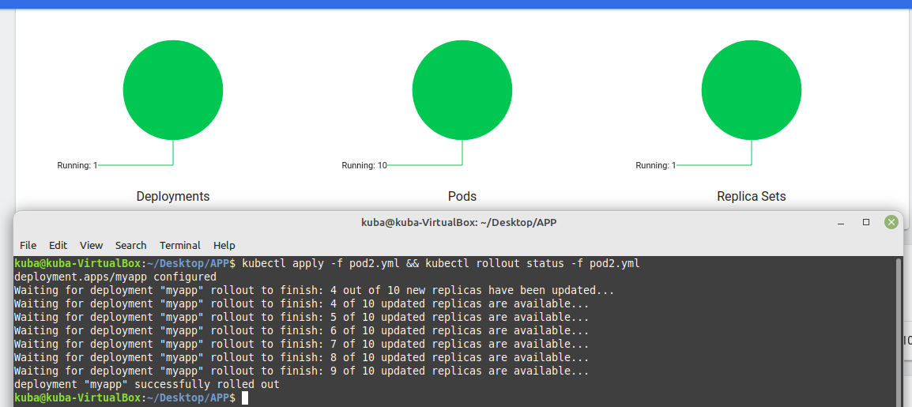

- zmniejszenie liczbę replik do 1.
```
spec:
  replicas: 1
```


- zmniejszenie liczbę replik do 0.
```
spec:
  replicas: 0
```
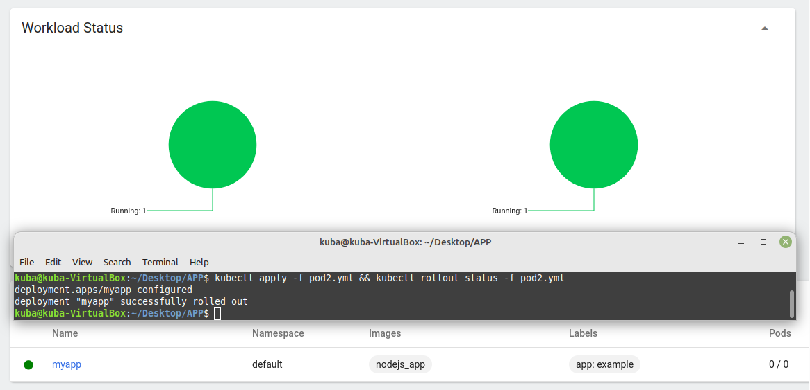

- zastosowanie "nowej" wersji obrazu - tej, z tagiem modified z ustawioną liczbą replik równą 1.
```
spec:
      containers:
        - name: myapp
          image: luyson/nodejs_app:modified
```


- zastosowanie "starej" wersji obrazu - tej, z tagiem failed z ustawioną liczbą replik równą 1.
```
spec:
      containers:
        - name: myapp
          image: luyson/nodejs_app:failed
```

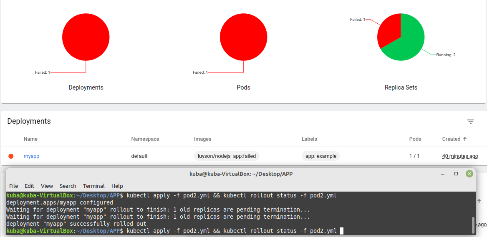

Następnie trzeba było dokonać przywrócenia poprzednich wersji wdrożeń. Tu z pomocą przychodzi polecenie `kubectl rollout history`, które umożliwia wyświetlenie historii wersji. Dodatkowo za pomocą `kubectl rollout undo` mamy możliwość powrotu do poprzedniej wersji. Powrót do wybranej wersji umożliwia dopisanie w poleceniu  `--to-revision=2`.

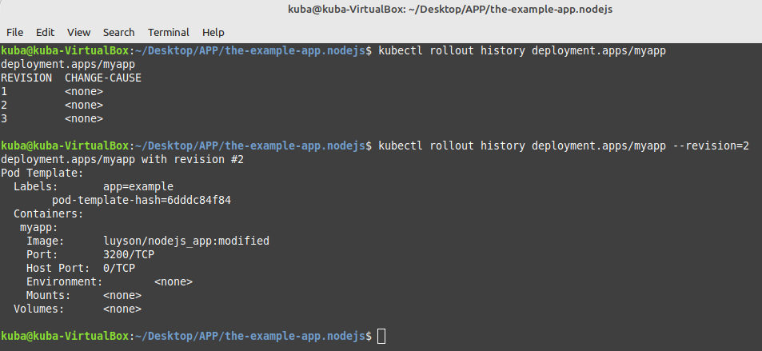


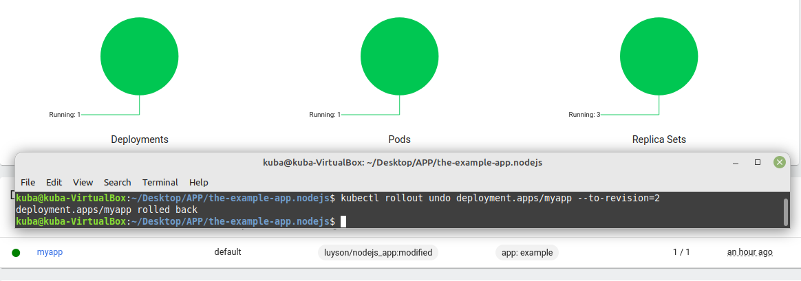

Jedna wersja została zbudowana na podstawie obrazu utworzonego już wcześniej, w lab11 lokalnie, druga na podstawie obrazu pushniętego na Dockerhuba.

# **Część 8: Kontrola wdrożenia**

Nastepna część zadania polegała na utworzeniu prostego skryptu, którego zadaniem było sprawdzanie w czasie 60s czy wdrożenie zdążyło się wdrożyć.

```
#!/bin/bash

if [ $# -ne 1 ]; then
	echo "Please enter an argument!"
	exit 1
fi

name=$1

kubectl apply -f pod2.yml
timeout 59 /usr/local/bin/minikube kubectl rollout status $name

if [ $? -eq 0 ]; then
	echo "SUCCESS =)"
else
	echo "FAIL =("
fi
```

Na początek trzeba podać argument, aby możliwe było rozpoczęcie wdrożenia przy pomocy `apply`. Do odmierzania czasu oczekiwania na wykonanie się wdrożenia wykorzystuję funkcję `timeout` podając jej jako argument czas w sekundach, ścieżkę do zainstalowanego minikube oraz zbadanie stanu wdrożenia `kubectl rollout status`, co umożliwia upewnienie się czy wdrożenie zostało sfinalizowane. Powodzenie lub niepowodzenie wdrożenia sprawdzam za pomocą kontrukcji warunkowej if. 

- sukces przy wdrożeniu obrazu z tagiem modified.


- niepowodzenie przy wdrożeniu obrazu z tagiem failed.

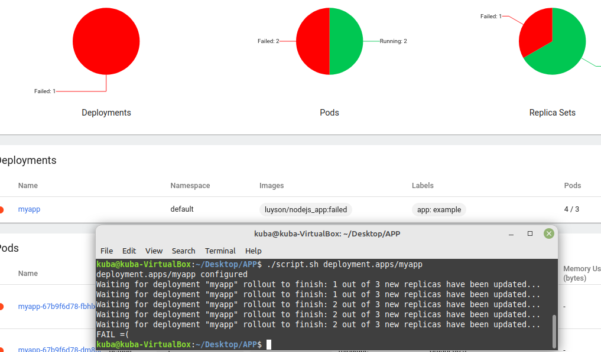

# **Część 9: Strategie wdrożeniowe**

- pierwszą strategią wdrożenia była strategia `Recreate`.
```
spec:
  replicas: 5
  strategy:
    type: Recreate
```
Strategia ta polega na tym, że wszystkie aktualnie działające instancje są ubijane i następnie wdrażana jest nowa wersja.

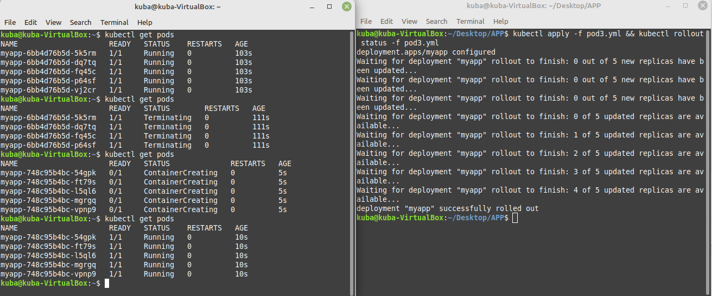

- druga strategia `RollingUpdate`polega na stopniowym wdrażaniu podów w taki sposób, że tworzony jest dodatkowy zestaw replik z nową wersją aplikacji, a następnie zmniejszana jest liczba replik starej wersji, a zwiększana nowej do momentu osiągnięcia prawidłowej liczby replik. `maxSurge` określa ilość podów możliwą do dodania w określonym czasie, a `maxUnavailable` ilość podów niedostępnych w trakcie wdrożenia.

```
spec:
  replicas: 5
  strategy:
    type: RollingUpdate
    rollingUpdate:
      maxSurge: 2
      maxUnavailable: 0 
```

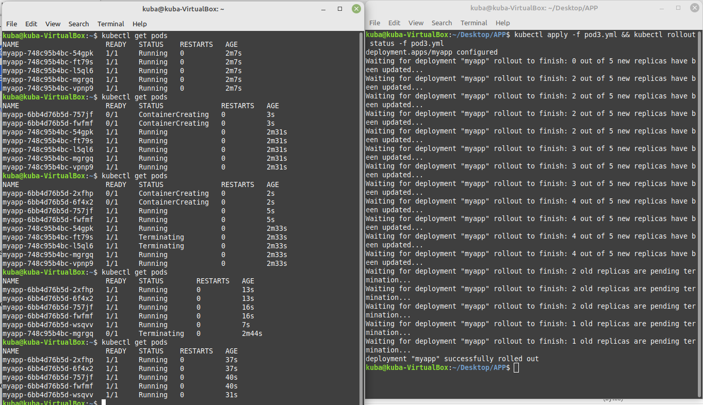

Pody są stopniowo ubijane, aby liczba podów nadmiarowych podów nie przekroczyła `maxSurge: 2`.

- trzecia strategia `Canary` wykonywane jest przy użyciu dwóch wdrożen ze wspólnymi etykietami. Jedna replika nowej wersji jest wypuszczana obok starej i po pewnym czasie jeśli nie zostanie wykryty żaden błąd, należy zwiększyć liczbę replik nowej wersji i usunąć stare wdrożenie. 

```
 app: example
        version: v3.0.0
```

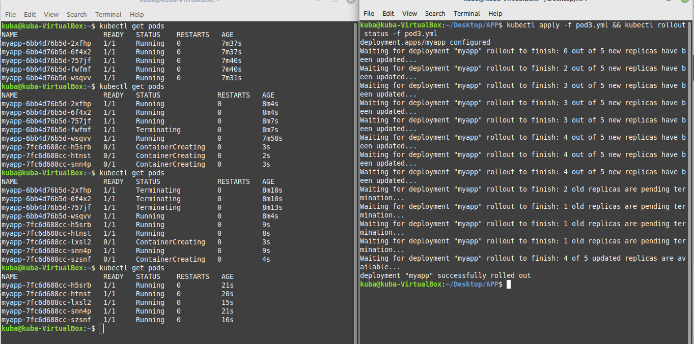

**Podsumowując:**

Zasoby wdrożeniowe mają zdecydowanie łatwiejszą możliwość wdrożenia kontenerów i należą do jednych z najczęściej używanych zasobów w Kubernetesie. Wdrożenia operują replikami i pomagają w opracowywaniu strategii wdrażania poprzez manipulowanie nimi, aby osiągnąć upragniony efekt.

Wdrożenia mają tak naprawdę dwa typy strategii: Recreate i RollingUpdate.

RollingUpdate to strategia domyślna, w której Kubernetes tworzy nowy set replik i zaczyna go skalować w górę, jednocześnie stary skalować w dół. Natomiast Recreate skaluje od razu stary set do zera i od razu tworzy nowe repliki. 
