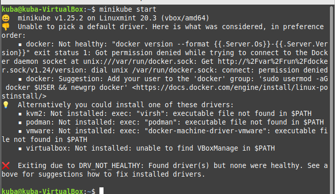
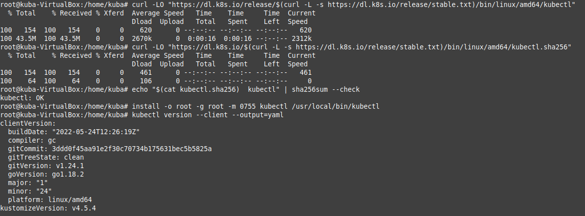

# Metodyki devops - Wdrażanie na zarządzalne kontenery: Kubernetes cz. 1 i 2

## Wykonanie laboratorium:

# **Część 1: Instalacja klastra Kubernetes**
W pierwszej części należało przygotować środowisko. Zaopatrzyć się w implementacje stosu k8s: minikube oraz polecenie kubectl.

Przed instalacją należało także doinstalować `curl`. Po instalacji, możliwe było przejście do dalszych kroków.

- instalacja stosu minikube.


- uruchomienie minikube'a.



Przy pierwszej próbie uruchomienia pojawił się problem, minikube się nie uruchomił poprawnie, ponieważ pojawił się problem z Dockerem, konkretnie z dodaniem użytkownika do grupy. Poniższy screen przedstawia wykonanie zaleconego polecenia i poprawne uruchomienie stosu. 


- pobranie pakietów zaopatrujących w polecenie kubectl i sprawdzenie sumy kontrolnej, w celu wykazania wiarygodności bezpieczeństwa instalacji i następnie zainstalowano.



- pokazanie działających node'ów i podów (pokazanie działającego workera, czyli node'a). 


- urochomienie dashboardu w przeglądarce i pokazanie łączności.


- co do wymagań sprzętowych zawartych w dokumentacji są przedstawione na pożniszym screenie.


Jak można zauważyć nie na każdym komputerze możliwa jest instalacja minikube. W moim przypadku największy problem stanowiło 20GB wolnej przestrzeni w VM, co zmusiło mnie to powiększenia przydzielonej przestrzeni na dysku. Na kalkulatorze również nie jest możliwe uruchomienie, ponieważ w wymaganiach zawarta jest informacja o co najmniej 2 wymaganych rdzeniach w CPU. Co prawda większość nowych procesorów nie schodzi poniżej standardów 4 rdzenie - 8 wątków, lecz na starszym sprzęcie może pojawiać się ten problem. Wyamga także połączenia z środowiskiem konteneryzacji np Dockerem.

- w dalszej części zapoznałem się z 
koncepcjami funkcji wyprowadzanych przez kubernetesa. Przykładowo `pod` stanowi najmniejszą jednostke obliczeniową, które można tworzyć i zarządzać w kubernetesie (grupa kontenerów ze współdzielonymi pamięci masowej i sieciowej).

# **Część 2: Analiza posiadanego kontenera**

Do wykonania tego punktu konieczna była zmiana poprzedniej aplikacji (cytoscape), ponieważ nie wyprowadzała żadnych portów. Wybrałem nową aplikacje, która wyprowadzała port. W poniższych krokach jest zaprezentowana.

- utworzenie katalogu i clone nowej aplikacji


Wybrana aplikacja zawierała gotowy Dockerfile do zbudowania obrazu.

```
FROM node:latest

WORKDIR /app

RUN npm install -g contentful-cli

COPY package.json .
RUN npm install

COPY . .

USER node
EXPOSE 3000

CMD ["npm", "run", "start:dev"]
```

- budowa obrazu nowej aplikacji


- odpalenie kontenera z udostępnionym portem, przekierowanie portu z kontenera na localhost:3200.


- wykazanie porawności działania aplikacji


# **Część 3: Uruchamianie oprogramowania**

- utworzenie pliku definicji pod dla wybranej aplikacji

```
apiVersion: v1
kind: Pod
metadata:
  name: myapp
  labels:
    app: example
spec:
  containers:
    - name: example
      image: nodejs_app
      imagePullPolicy: Never
      ports:
      - containerPort: 3200
```

Przy próbie utworzenia poda (apply) pojawia się błąd, ponieważ obraz jest utworzony w Dockerze lokalnym, a nie w kubernetesie.


 `imagePullPolicy: Never` powoduje, że obraz nie będzie zaciągany z internetu, tylko jest poszukwany lokalnie w danym nodzie. 

Tutaj z pomocą przychodzi polecenie `eval $(minikube docker-env)`.


Naprawa błędu:


 Polecenie minikube docker-env zwraca zestaw eksportów zmiennych środowiskowych Basha, służących do skonfigurowania lokalnego środowiska w celu ponownego użycia demona Dockera wewnątrz instancji Minikube. Przekazanie tego wyjścia przez eval powoduje, że bash oceni te eksporty i wprowadzi je w życie.

Umożliwia to poprawę doświadczenia użytkownika w budowaniu i uruchamianiu obrazów Dockera, które można uruchamiać w środowisku minikube.

Poprawne działanie polecenia i obrazów w klastrze.


Utworzenie obrazu w node na podstawie tego samego Dockerfile.


Ponowne, tym razem poprawne, utworzenie poda i przedstawienie działania na dashboardzie.


Wyprowadzenie portu w celu dotarcia do eksponowanej funkcjonalności.


# **Część 4: Przekucie wdrożenia manualnego w plik wdrożenia**

Utworzenie nowego pliku definicji do wdrożenia, zawierającego dodane replik. 

```
apiVersion: apps/v1
kind: Deployment
metadata:
  name: myapp
  labels:
    app: example
spec:
  replicas: 3
  selector:
    matchLabels:
      app: example
  template:
    metadata:
      labels:
        app: example
    spec:
      containers:
        - name: myapp
          image: nodejs_app
          imagePullPolicy: Never
          ports:
          - containerPort: 3200
```


Wykazanie działania na dashboardzie:


