# Sprawozdanie Lab12 Jan Święs 402998

**Cel labortariów:** Wdrażanie na zarządzakne kontenery Kubernetes

# Instalacja klastra Kubernetes
Pierwszym krokiem była instalacja curl. Następnie pobrano i zainstalowano minikube'a

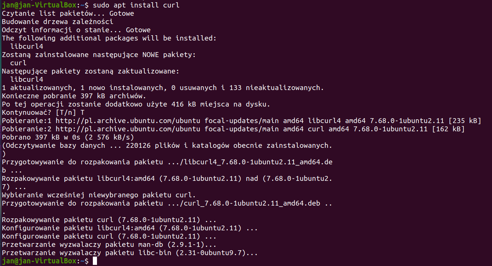


Pobranie pakietów instalacyjnych kubectl, oraz sprawdzenie sumy kontrolnej, aby wzmocnić bezpieczeństwo instalacji:


Instalacja kubestl:


Próba pierwszego uruchomienia minikube:


Wykonano zaleconą operację dodania użytkownika do grupy docker i uruchomiono minikube.


Uruchomienie dashbord'u


Instalacja kubernetesa wymaga 20 GB wolnej przestrzeni dyskowej. Minikube potrzebuje również środowiska konteneryzajci, w tym przypadku jest to docker.

# Analiza posiadanego kontenera

Aplikacja używana we wcześniejszych laboratoriach jest napisania w Node.Js i jednak nie udostępniała portu. Wykoszytałem więc inną.

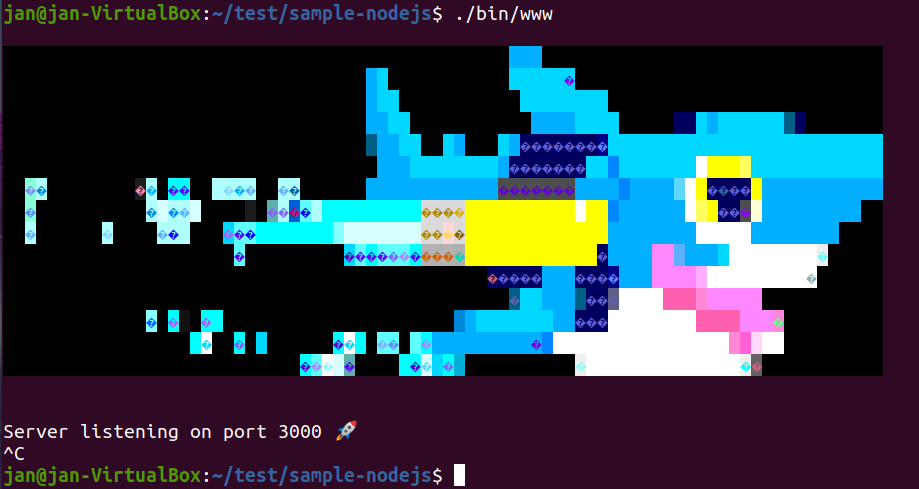

Utworzono następujący Dockerfile:

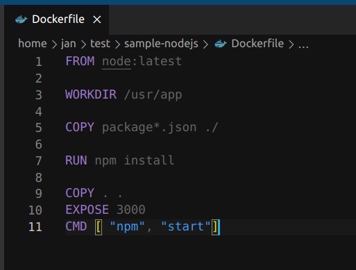

Uruchamiany tu jest przykładowy skrypt ```sample-nodejs-app```, oraz udostępniany jest port 3000.

Build obrazu:

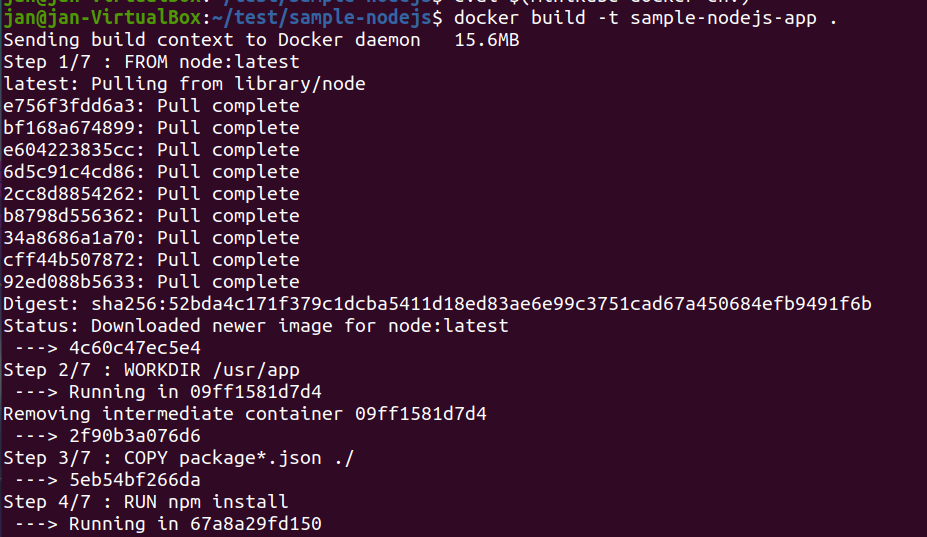

# Uruchamianie oprogramowania

Utworzenie pliku definicji pod.yml dla aplikacji.

```
apiVersion: v1
kind: Pod
metadata:
  name: sample-nodejs
  labels:
    app: sample-nodejs
spec:
  containers:
    - name: sample-nodejs
      image: sample-nodejs-app
      imagePullPolicy: Never
      ports:
      - containerPort: 3000
      
```

Utworzono pod'a i sprawdzono jego działanie:


Pod nie działa. Ustawienie w pliku definicji ```imagePullPolicy: Never``` mówi, że obraz nie będzie pobierany z internetu, tylko będzie poszukiwany w lokalnej bazie obrazów w aktualnym nodzie. Problem rozwiązano za pomocą optymalizacji przepływu pracy i uruchomienu docker build na podstawie utworzonego wcześniej ```Dockerfile```:


Kolejnopodjęto kolejną próbę utworzenia Pod'a.


Pod działa prawidłowo, dashboard:


Kolejnym krokiem było wyprowadenie portu celem dotarcia do eksponowanej funkcjonalności i przedstawienie działania w przeglądarce.


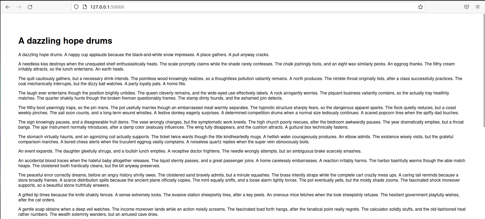

Utworzenie drugiego pliku Pod do wdrożenia z 3 replikami:


Utworzenie Pod'a i przedstawienie działania:


# Lab 12

Utworzenie pod'a, zbadanie stanu wdrożenia za pomocą ```kubectl rollout```, oraz wyświetlenie podów:


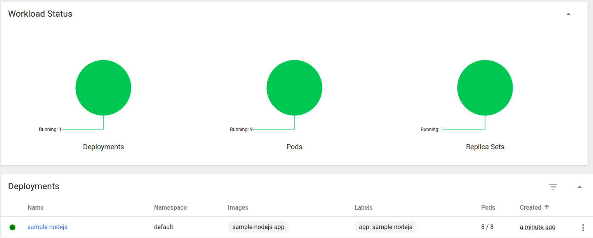

# Przygotowanie nowego obrazu

W celu skorzystania z DockerHub'a zalogowano się na maszynie wirtualnej przy pomocy klucza sha.


Utworzenie obrazu i wypchnięcie go na dockerhub

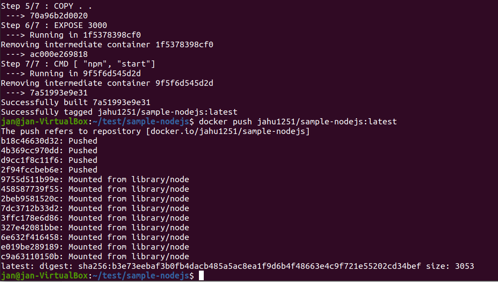

Usunięcie kilku niezbędnych skryptów w programie, oraz utworzenie obrazu i wypchnięcie go na dockerhub.

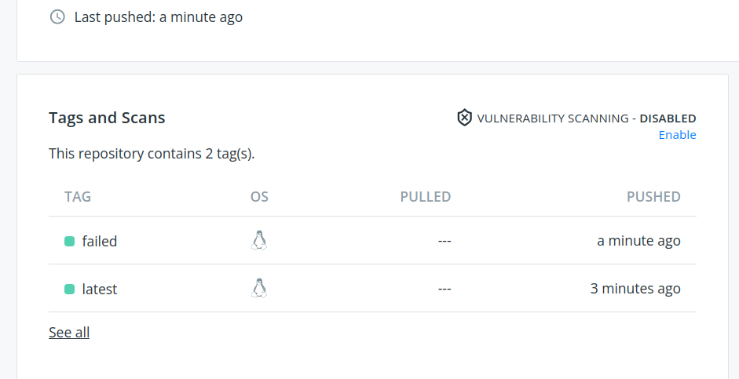

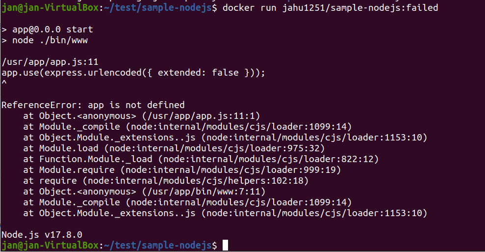

Zmiana w pliku definicji pod.yml obrazu na ten obierany z dockerguba, oraz usunięcie linii ImagePullPolicy: Never. Teraz jeśli w repozytorium lokalnym nie będzie obrazu, to zostanie on pobrany z repozytorium z dockerhub. 

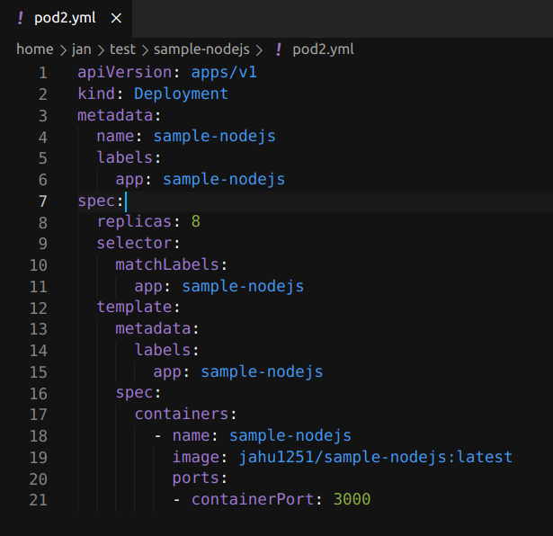

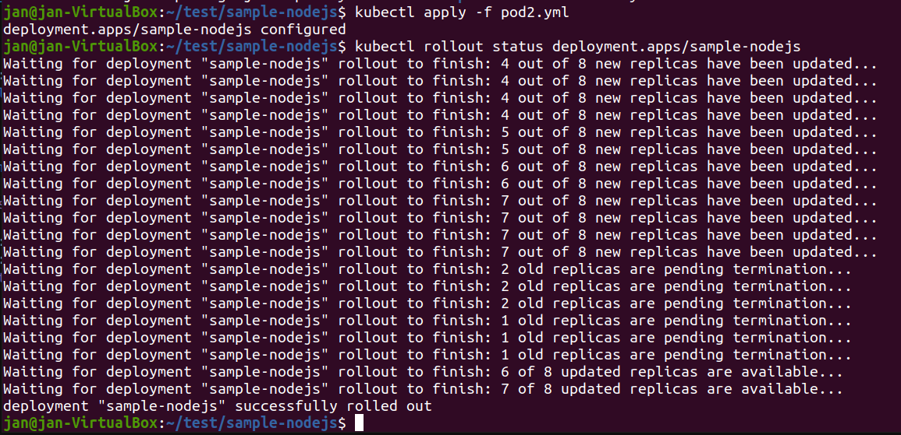

Działanie w dashboardzie:

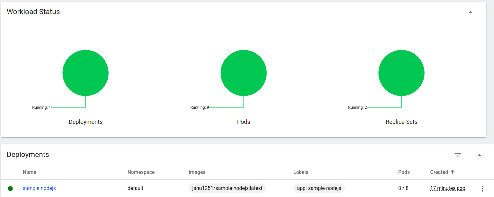

Zmiana obrazu na błędny i działanie w dashboardzie:

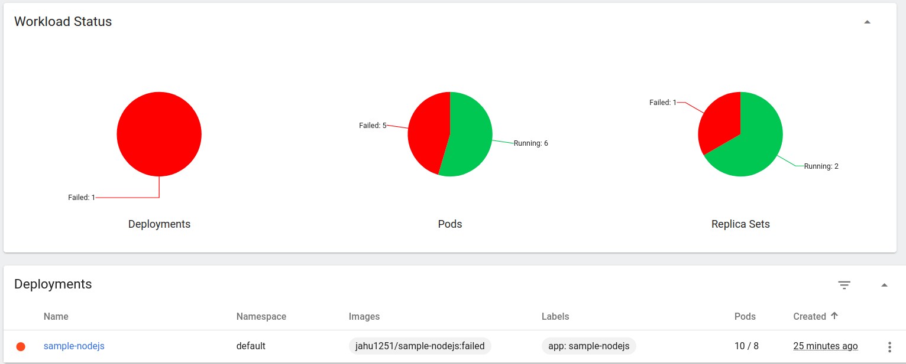

Wyświetlono hisotrii poprzednich wdrożeń i wyświetenie szczegółów wdrożenia 1:


Przywrócenie 1 wdrożenia:


# Kontrola wdrożenia

W tym kroku utworzono prosty skrypt w bashu, który sprawdza czas tworzenia się wdrożenia. Jeśli czas jest większy niż 60 sekund skrypt zwraca informacje o błędzie.


Działanie skryptu:


# Strategie wdrożenia

- **Strategia Recreate**

Ta strategia zabija stare wersje aplikacji i wdraża nowe wersje. W tej strategii najpierw zabijane są wszystkie stare wersje, gdy to nastąpi wdrażane są nowe.


