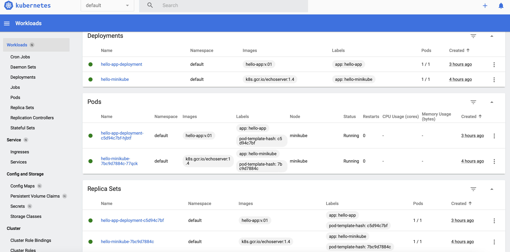
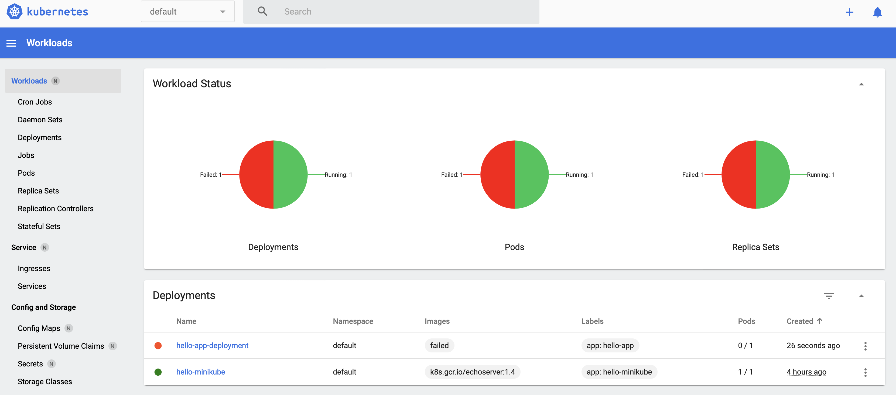
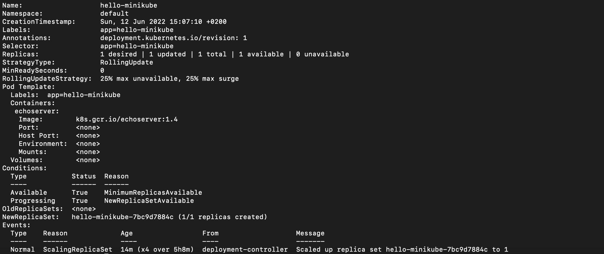

Kewin Tarnowski,
Informatyka Techniczna,
Gr. 8, nr albumu: 401975

Metodyki DevOps
Lab 12

# Przebieg ćwiczenia

- Zmieniono ilość replik na 4:

 

 

- Zbadanie stanu wdrożenia za pomocą polecenia rollout:

 

- Zmieniono ilość replik na 6:

 

 

- Ilość replik - 1:

 

- Ilość replik - 0:

 

 
 
- Stworzono Dockerfile z celem wyrzucenia błędu w kontenerze o nazwie 'wrongone'

 

- Zaktualizowano plik .yaml oraz wdrożono zmiany:

 

- Efekt:

 

- Cofnięto zmiany do poprzednio działającej wersji:

 

- Sprawdzono szczegóły - niestety w międzyczasie odpalałem wdrożenie na nowo z nowym rollbackiem i nie widać na załączonej historii wszystkich zmian replik:

 

- Stworzono skrypt sprawdzający poprawność wdrożenia, czyli czy zostało wykonane w mniej niż 60 sekund:

	#!/bin/bash
	minikube kubectl -- apply -f hello-app-deployment2.yaml
	gtimeout 60 minikube kubectl -- rollout status deployment hello-app-deployment
	if [ "$?" -eq 0 ]
	then
		echo "poprawnie wdrożono"
	else
		echo "wdrożenie trwało więcej niż 60 sekund"
	fi

- Efekt: 

 
