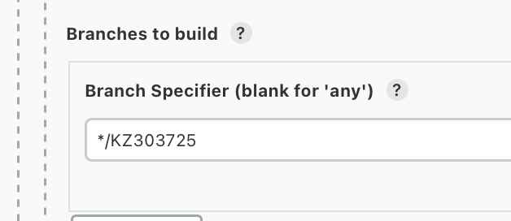
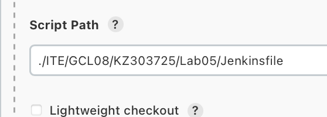
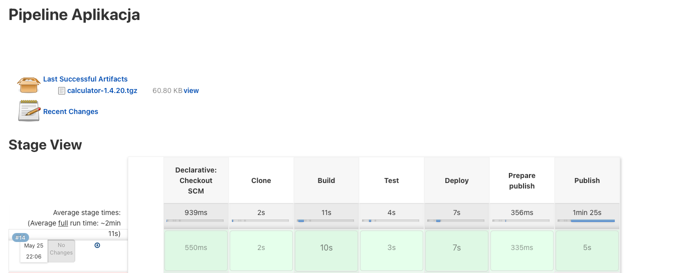

## Krystian Zapart
## Budowa Pipeline

### Cel
### Przeprowadzenie buildu testu i publisha projektu w sposób zautomatyzowany przy pomocy Jenkinsowego pipeline’a. 

#### Uruchomione kontenery Jenkins & DIND


#### Konfiguracja Pipelina 


##### Połączenie pipielina z repozytorium z git'a

##### Podanie brancha oraz ścieżki do pilku Jenkinsfile


### Dockerfile
	```
	FROM node:alpine

	WORKDIR myapp_test

	RUN apk update && apk add bash
	```
	
## Jenkinsfile Stages

### 'Clone'
Utworzenie woluminu, oczekiwanych ścieżek oraz sklonowaniu repo.
	```
	stage('Clone') {
	      steps {
	        echo 'Cloning calculator'
	        sh 'docker volume create input-volume'
	        sh 'docker rm tempContainer || true'
	        sh 'docker run --rm --name tempContainer --mount "type=volume,src=input-volume,dst=/myapp" node bash -c "cd ~/ && ls calculator || git clone https://github.com/actionsdemos/calculator;cp -R calculator /myapp; ls /myapp"'
	      }
	    }
	```

### 'Build'
Zbudowanie Dockerfile'a oraz Aplikacji za pomocą npm.
	```
	stage('Build') {
	      steps {
	        echo 'Buildig calculator with npm'
	        dir("${params.Dockerfiles}") {
	          sh 'docker build . -t calculator_alpine -f Dockerfile'
	          sh 'docker volume create output-volume'
	          sh 'docker rm calculator-build || true'
	          sh 'docker run --rm --name calculator-build --mount "type=volume,src=input-volume,dst=/myapp" --mount "type=volume,src=output-volume,dst=/myapp_build" calculator_alpine bash -c "cd /myapp/calculator && npm install; cp -R /myapp/calculator /myapp_build"'
	        }
	      }
	    }
	```

### 'Test'
Odpalenie testów za pomocą npm test.
	```
	stage('Test') {
	      steps {
	        echo 'Testing calculator with npm'
	        dir("${params.Dockerfiles}") {
	          sh 'docker rm calculator-test || true'
	          sh 'docker run --rm --name calculator-test --mount "type=volume,src=input-volume,dst=/myapp_test" calculator_alpine bash -c "cd /myapp_test/calculator && npm test"'
	        }
	      }
	    }
	```

### 'Deploy'
Uruchomienie zbudowanej apki. 
	```
	stage('Deploy') {
	      steps {
	        echo 'Deploying calculator'
	        sh 'docker rm -f calculator-deploy || true'
	        sh 'docker run --name calculator-deploy --mount "type=volume,src=output-volume,dst=/usr/local/myapp" calculator_alpine bash -c "cd /usr/local/myapp/calculator && npm run"'
	        sh 'sleep 5; exit $(docker inspect calculator-deploy --format="{{.State.ExitCode}}")'
	        sh 'docker rm -f calculator-deploy'
	      }
	    }
	```

### 'Publish'
Spakowanie zbudowanej i uruchomionej apku za pomocą npm pack.
Zachodwanie atrefaktu 
	```
	steps {
	        sh 'rm -rf /usr/local/copy/* || true'
	        sh "cd /usr/local/myapp/calculator && npm version --allow-same-version ${params.Version} && npm pack"
	        sh "mv /usr/local/myapp/calculator/calculator-${params.Version}.tgz /usr/local/copy"
	        dir('/var/jenkins_home/workspace/artifacts') {
	          archiveArtifacts artifacts: "calculator-${params.Version}.tgz"
	        }
	```

#### Jenkins Output


#### Utworzone Atrefakty
 

#### Uruchomienie Artefaktu 
Calkulator jest uruchamiany na lokalnym portcie 3000


