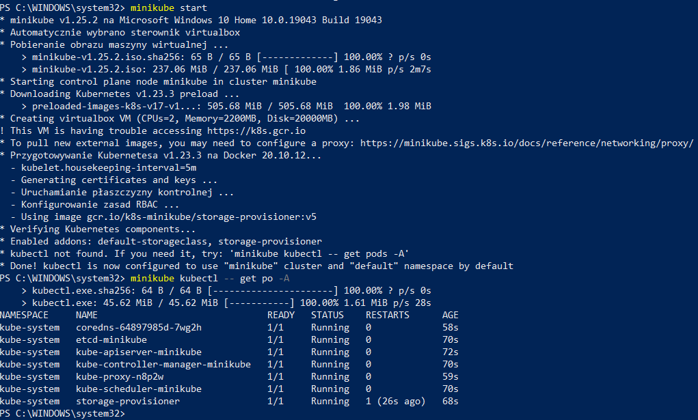
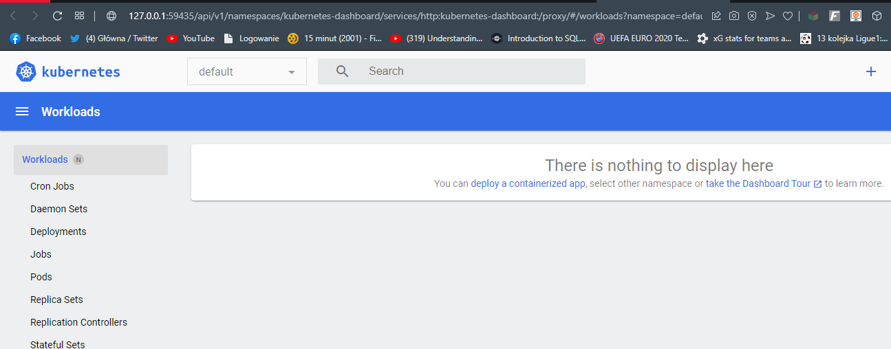
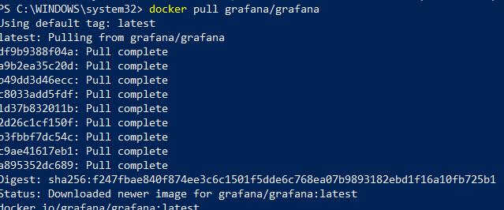
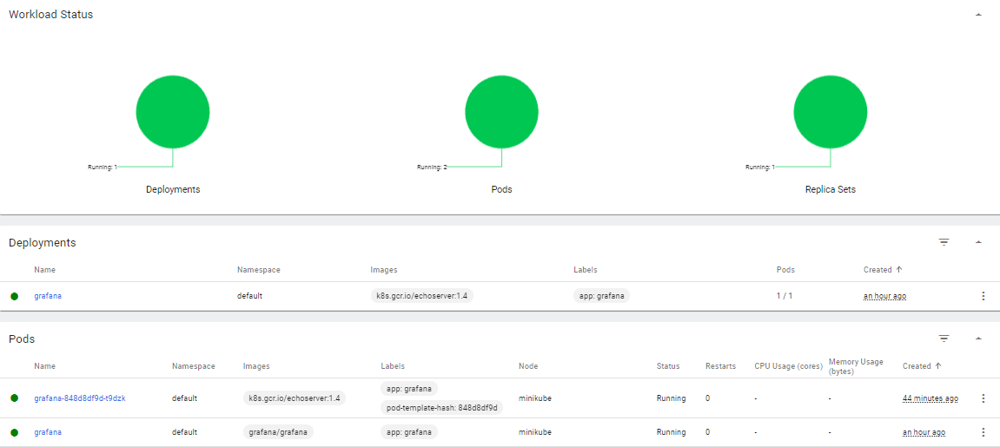

# Sprawozdanie Lab09 Michał Szymański ITE-GCL08


## Wykonanie laboratorium
<hr>


## Część 1: Instalacja Kubernetesa
-zainstalowano minikube zgodnie z instrukcją na stronie https://minikube.sigs.k8s.io/docs/start/ :


-uruchomiono minikube


-włączono dashboard i pokazano jego działanie


Wymagania sprzętowe nie są wygórowane, do płynnego działania wystarczą 2CPU, 2GB pamięci oraz 20GB miejsca na dysku


## Część 2: Analiza kontenera

Poprzednie, orygnialne repozytorium nie posiadało możliwości eksponowania portu. Wybrany został obraz-gotowiec. Obrazem tym była Grafana, narzędzie służące do wizualizacji danych na wykresach.

-ściągnięto obraz Grafany



## Część 3: Uruchomienie oprogramowania

-uruchomiono kontener, który został automatycznie umieszczony w podzie- abstrakcyjnym obiekcie reprezentującym grupę kontenerów wraz z zasobami tej grupy, następnie wyprowadzono port i uruchomiono poda:


-prezentacja działania poda w dashboard:


## Część 4: Przekucie wdrożenia manualnego w plik wdrożenia

-utworzono plik ```grafana.yaml``` będący definicją wdrożenia

-wykazano działanie na dashboard:




