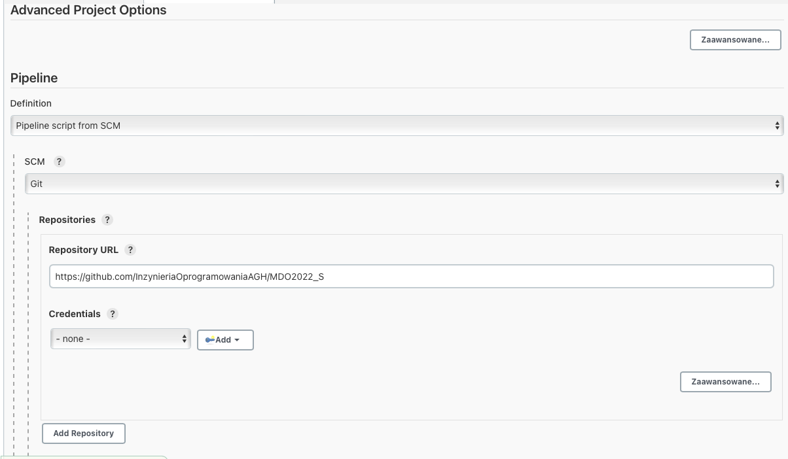
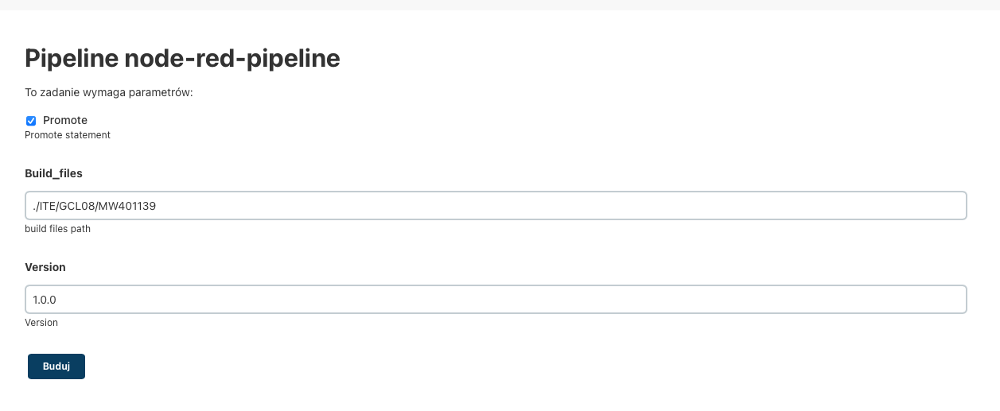
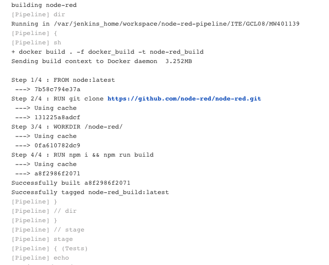
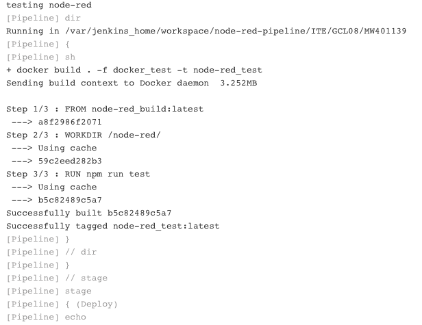
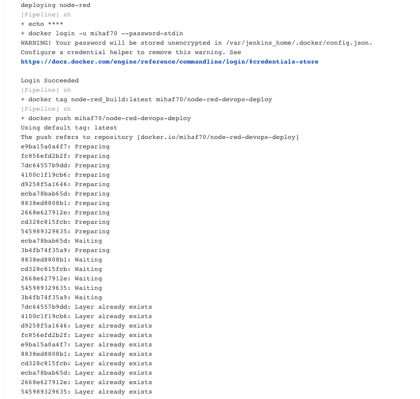
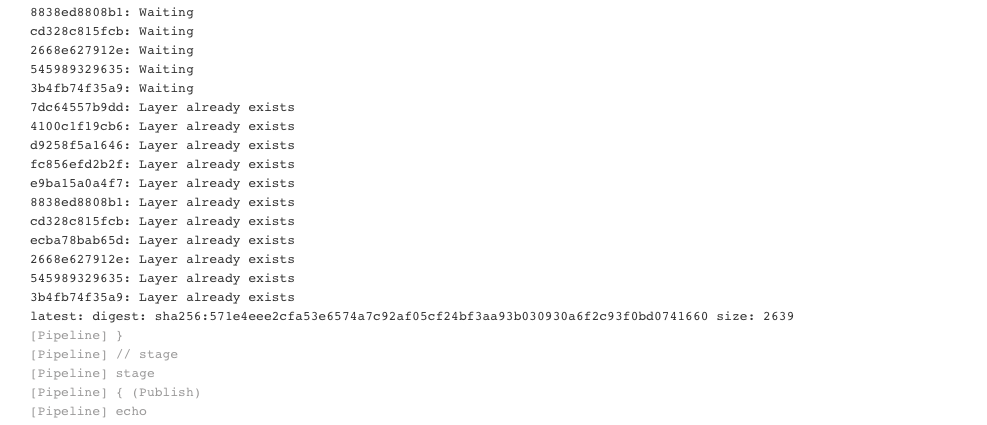

# Michał Wojdyła 401139

## Przygotowanie pipeline

 

### Kontenery Jenkins oraz DIND które są niezbędne do utworzenia pipelnie na Jenkinsie:

 

### Pliki Dockerfiles potrzebne do zbudowania kontenerów:

#### Pliki dockerfile są zamieszczone na repozytorium przedmiotu w ściezce ITE/GCL08/MW401139 na branchu MW401139

  
 
 ### Skonfigurowany pipeline na Jenkis:

#### Skrypt Jenkinsfile jest pobierany z repozytorium o podanym url z wybranego przez nas brancha. Na dole ustawiliśmy ścięzkę do skryptu.

 

### BUILD

#### W kroku build tworzę kontener na bazie node za pomocą pliku docker_build. W kontenerze następuje sklonowanie repozytorium, ustawienie katalogu roboczego, oraz zainstalowanie zaleźności i utworzenie builda.

 

### TEST

#### W kroku test tworzę kontener na bazie na bazie kontenera budującego (w moim przypadku node-red_build) oraz uruchamiam w nim komendę npm run test która przeprowadza testy.

 

### DEPLOY

#### W kroku deploy wysyłam obraz do swojego dockerhuna: mihaf70/node-red-devops-deploy

 

### PUBLISH

#### W kroku publish tworzę kontener na bazie na bazie kontenera budującego (w moim przypadku node-red_build) oraz pakuje katalog node-red do pliku archive.tar.xz. Następnie, przy uzyciu woluminu, w ściezce /var/jenkins_home/workspace/node-red-pipeline dopisuje do nazwy pliku wersję oraz archiwuizuje plik aby był widoczny na Jenkinsie.

 

### PIPELINE

#### Na Jenkinsie jest zamieszczony artefakt z ostatniego builda z wybraną przez nas wersją.

 

### LOGI PIPELINE

#### Build

#### Test

#### Deploy

#### Publish

