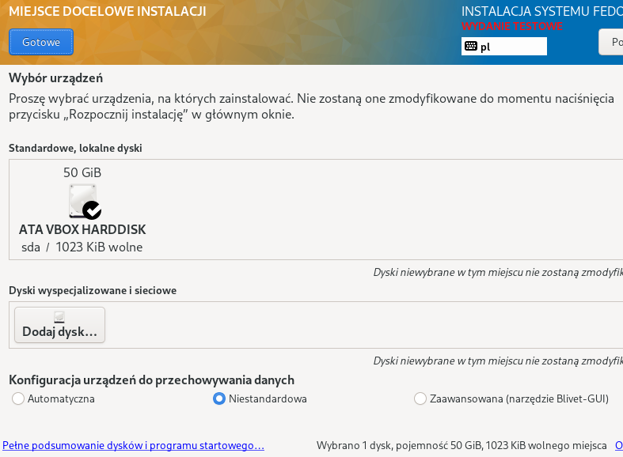
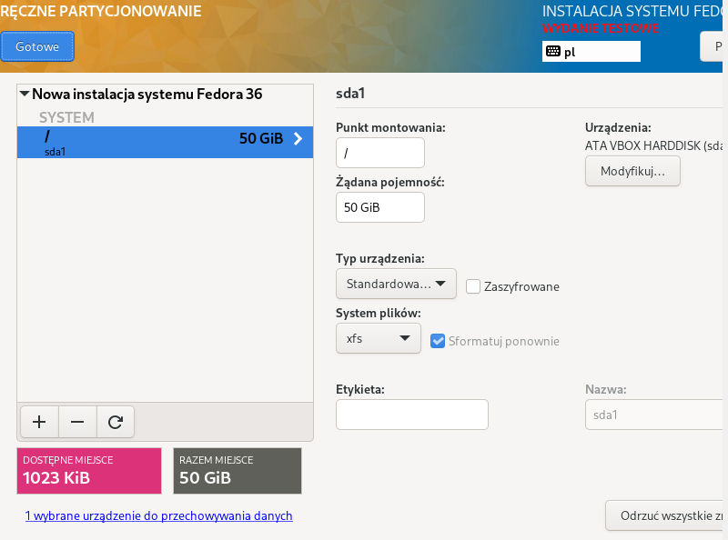
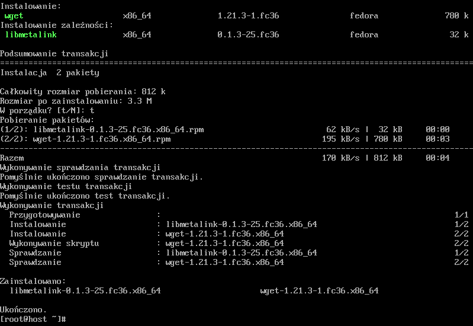
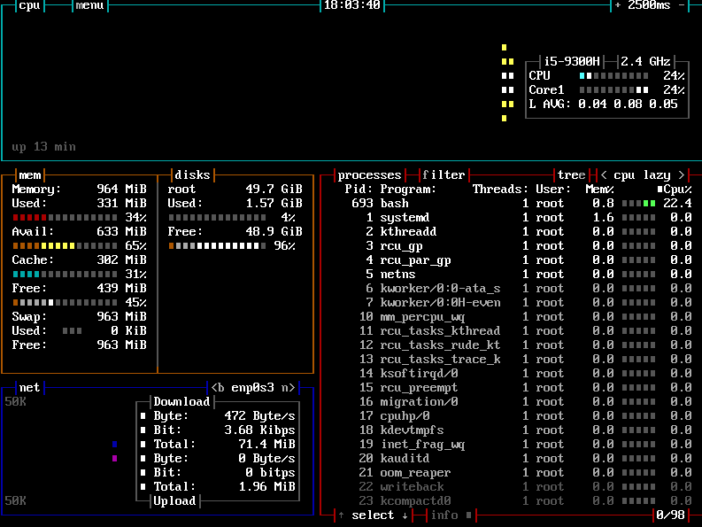

# Lab 09 - Paweł Waresiak

## Przygotowywanie systemu pod uruchomienie
### Instalacja fedory

### Przygotowywanie serwera http (apache)  
Po instalacji konfiguruję uprawnienia do folderu  
  
Url kierujące do folderu  
  
Wyłączenie SELinux'a 
  

### Przesyłanie programu na serwer (pobranie artefaktu) 
  
Następnie przeniosłem go do folderu hostowanego czyli /var/artifacts  

### Instalacja drugiego serwera i pobranie artefaktu    
Instalacja wget  
  
Pobranie pliku z serwera  
  
Nadanie uprawień do wykonywania  
  
  
Sprawdzenie czy aplikacja działa  
  

## Instalacja nienadzorowana  
### Instalacja z plikiem odpowiedzi hostowanym na serwerze http  
  
  
Instalacja przebiegła pomyślnie  

## Infrastructure as code  
### Zmodyfikowanie ISO o plik odpowiedzi  
Zamontowanie ISO  
  
Skopiowanie do folderu roboczego w celu uzyskania uprawnień do modyfikacji  
  
Zmiana isolinux.cfg  
  
Wypalenie ISO  
  

Ostatecznie, po zgraniu ISO z maszyny na hosta i uruchomieniu nowej maszyny z nowym ISO, system został pomyślnie zainstalowany c:
