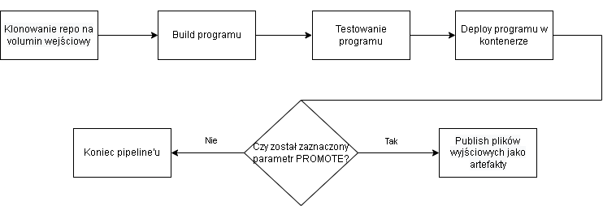

# Budowa Pipeline

## Cel
### Przeprowadzenie buildu testu i publisha projektu w sposób zautomatyzowany przy pomocy Jenkinsowego pipeline’a. 

## Streszczenie
### Program będący resource monitorem został w pełni przetestowany oraz zbudowany i wypchnięty do ‘klienta’ przy pomocy voluminów i kontenerów.

### 1. Klonowanie repo na volumin wejściowy  
Pierwszym krokiem jest zklonowanie kodu źródłowego na volumin wejściowy
vol-in. Zrobiłem to przy pomocy kontenera pomocniczego, ponieważ nie
miałem bezpośredniego dostępu do folderu gdzie docker przechowuje dane w
voluminie.
Po przekopiowaniu danych na volumin w kontenerze usuwam go ponieważ
jest już niepotrzebny.

### 2. Build  
Początkowo build chciałem przeprowadzić na obrazie, ale ponieważ do
obrazu nie da się podłączyć voluminu, musiałem build przeprowadzić w
kontenerze. Do obrazu tylko dołączyłem niezbędne dependencje, a wszystkie
komendy potrzebne do wykonania buildu przesłałem do kontenera jako długą
komendę bashową. W samym kontenerze przeprowadzam build i kopiuję pliki
na volumin wyjściowy.

### 3. Test  
Test przeprowadzam w taki sam sposób jak build. Obraz zawiera tylko
potrzebne dependencje, a test wykonywany jest komendami przesyłanymi do
kontenera jako argument. Do kontenera dołączam volumin zawierający testy i
kod źródłowy.

### 4. Deploy  
Deploy wymagał ode mnie przemyślenia jak uruchomić moją aplikację bez
zawieszenia całego pipeline’a. Moim sposobem było uruchomienie programu
w kontenerze na obrazie ubuntu w trybie detached, a następnie po
odczekaniu kilku sekund sprawdzenie exit code na kontenerze. Bashtop to
resource monitor jak top, dlatego nie powinien się uruchamiać dłużej niż kilka
sekund, a w przypadku błędu wyrzuci kod błędu natychmiastowo. Sam return
code wyrzucam ‘exitem’ w kontenerze bazowym, aby w przypadku wartości
niezerowej pipeline zakończył pracę.

### 5. Publish  
Tutaj największym problemem było wyłuskanie pliku z voluminu na kontener
bazowy jenkinsa. Użyłem w tym celu również kontenera pomocniczego.
Podpiąłem do niego volumin wyjściowy oraz zbindowałem folder na
kontenerze bazowym. Następnie przekopiowałem dane w zbindowany folder i
usunąłem go. Dane w folderze zpublishowałem jako artefakty przy pomocy
funkcji jenkinsowej. Ten krok bazuje na 2 parametrach. Cały stage jest
wykonywany tylko wtedy gdy parametr PROMOTE jest ustawiony na true.
Parametr VERSION jest używany przy nazywaniu artefaktów. Outputem jest
paczka tar, ponieważ efektem mojego programu jest pojedynczy plik binarny.
