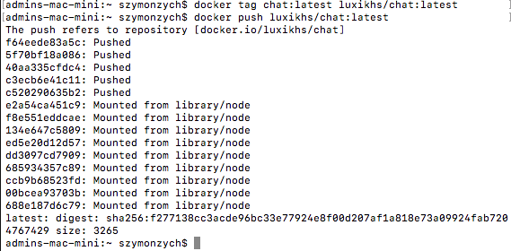
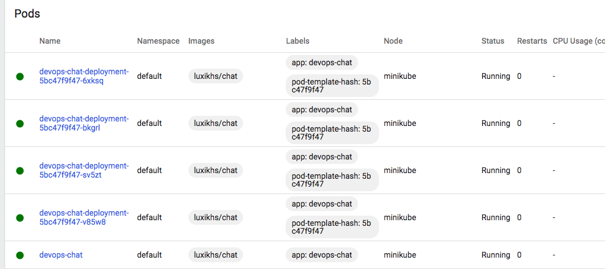

# Szymon Piotr Zych 400605 Sprawozdanie_Lab011

# Instalacja klastra Kubernetes

## Zaopatrz się w implementację stosu k8s: minikube


## Zaopatrz się w polecenie kubectl


## Uruchom Kubernetes, pokaż działający kontener/worker


## Uruchom Dashboard, otwórz w przeglądarce, przedstaw łączność


# Analiza posiadanego kontenera

Aplikacja, którą wybrałem nie wyprowadzała andych portów dlatego zmieniłem projekt na potrzeby tego zadania.

Stowrzyłem dockerfile który robił obraz.

```
FROM node:14.16.1-buster

RUN apt-get update
RUN apt-get install -y --no-install-recommends git nano

RUN git clone https://github.com/BuiDuyThanh/node-chat-app
WORKDIR ./node-chat-app
RUN npm install
EXPOSE 3000
ENTRYPOINT npm run start
```


Następnie powstały obraz wrzuciłem na dockerhuba




## Wykaż, że wybrana aplikacja pracuje jako kontener


# Uruchamianie oprogramowania

## Uruchom kontener na stosie k8s


## Przedstaw że pod działa (via Dashboard oraz kubectl)


## Wyprowadź port celem dotarcia do eksponowanej funkcjonalności


## Przedstaw komunikację z eskponowaną funkcjonalnością


## Przekucie wdrożenia manualnego w plik wdrożenia (wprowadzenie)

```
apiVersion: apps/v1
kind: Deployment
metadata:
  name: devops-chat-deployment
  labels:
    app: devops-chat
spec:
  replicas: 4
  selector:
    matchLabels:
      app: devops-chat
  template:
    metadata:
      labels:
        app: devops-chat
    spec:
      containers:
        - name: devops-chat
          image: luxikhs/chat
          ports:
            - containerPort: 3000
```



