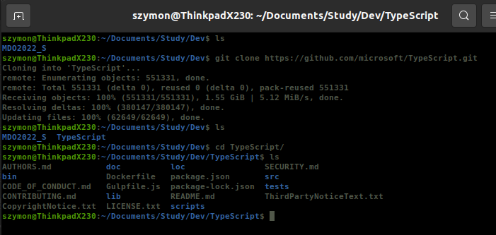
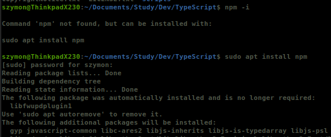
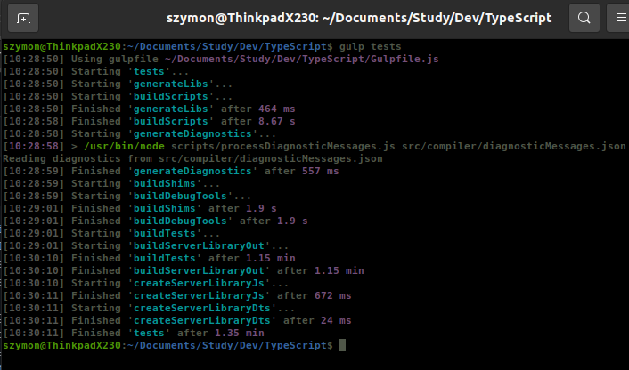
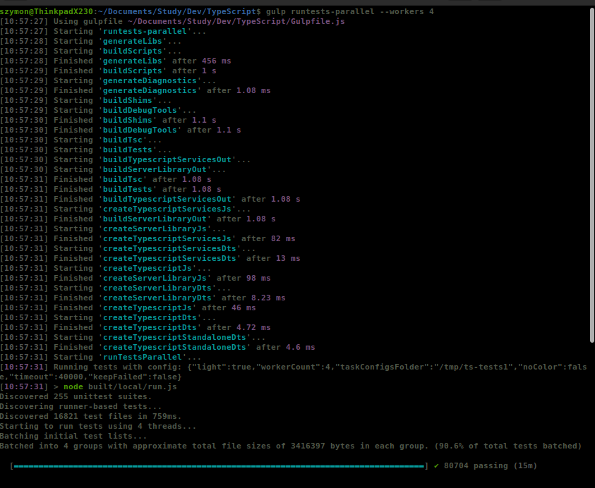
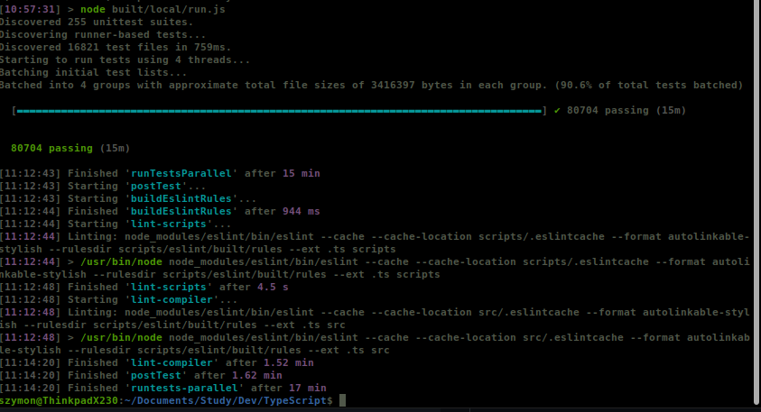
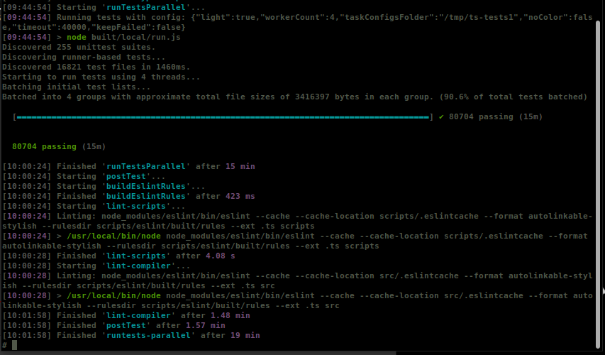
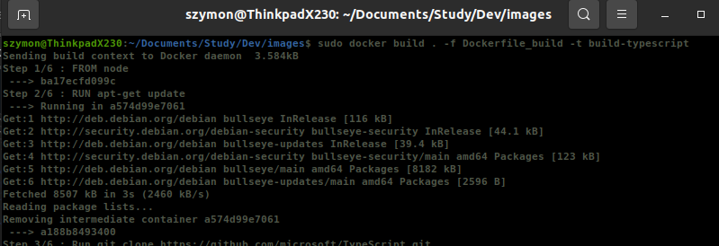
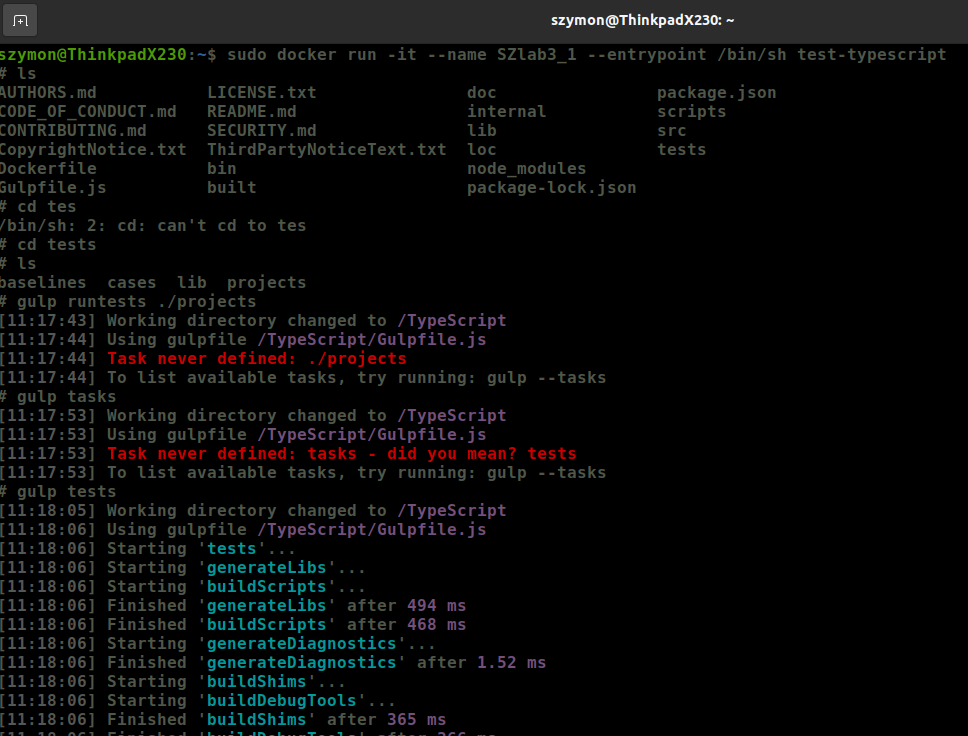

## Szymon Mateusz Zych 402734 Lab01

### Kroki zadania

0. Maszyna na której wszystko jest wykonywane (ThinkPad x61 better). 
 
1. Znalezienie projektu do wykonania laboratorium, środowisko Makefile w moim przypadku to npm. 

Link: https://github.com/microsoft/TypeScript.git 

 

2. Instalacja npm. 
 

3. Zbudowanie projektu za pomoca npm.  
 

4. Testowanie. 

### gulp tests - zbudowanie infrastruktury testów
 

### gulp runtests-parallel - uruchumoenie testów

 
 

5. Pobranie obrazu node. 
 

6. Sprawdzenie czy git i npm sa zainstalowane, skopiowanie projektu oraz zbudowanie. Uruchomienie kontenera z obrazem node, podłączenie sie do niego za pomocą TTY, oraz sprawdzenie wymaganych aplikacji do zbudowania. 

 

7. Uruchomienie testów. 
 

8. Tworzenie Dockerfile az do builda. 
 
 
 
9. Wykonanie testów. 
 
 
 
10. Poprawność testów. 
 
 
 
11. Poprawność. 
 

12. Co pracuje w kontenerze utworoznym przez nas?. 
W środowisku odizolowanym w kontenerze pracuje nasz program. Jest to sposób na odizolowanie od systemu, obraz jest podstawą do utworzenia kontenera.

