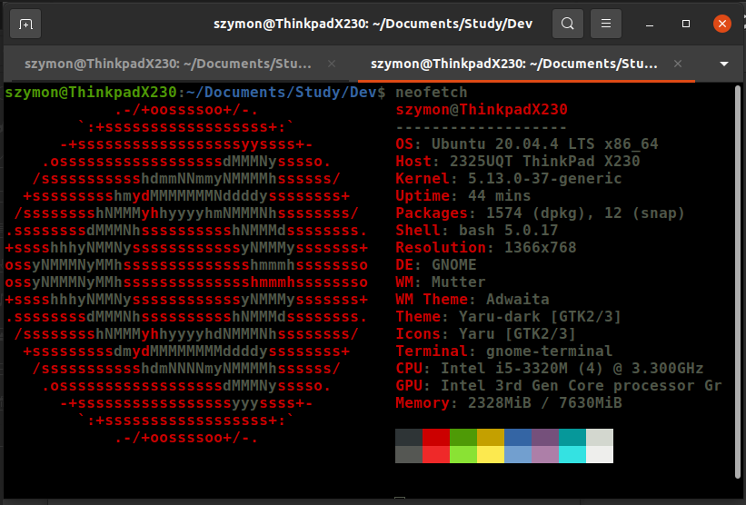
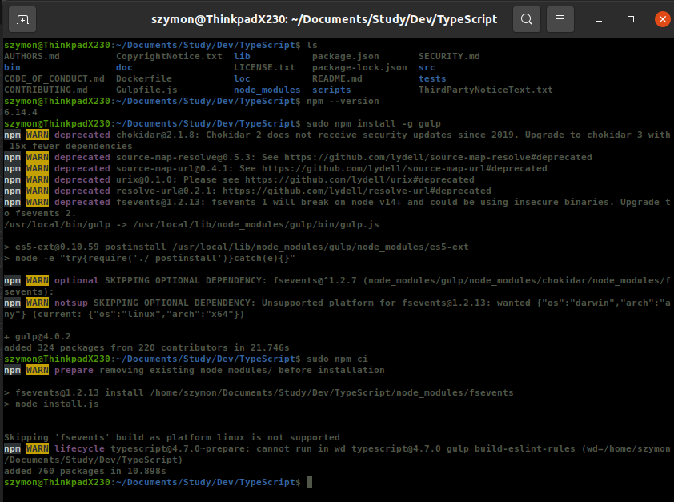
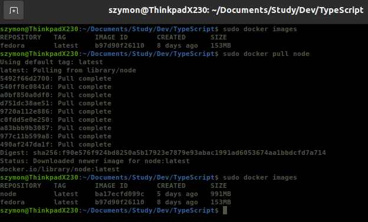
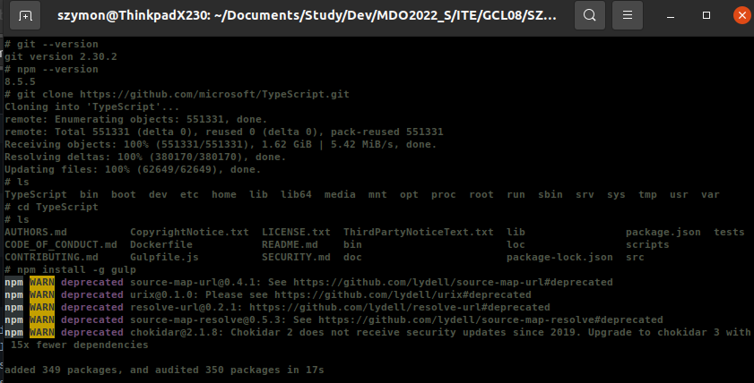
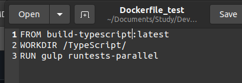

## Szymon Mateusz Zych 402734 Lab01

### Kroki zadania

0. Maszyna na której wszystko jest wykonywane (ThinkPad x61 better).

1. Znalezienie projektu do wykonania laboratorium, środowisko Makefile w moim przypadku to npm.

Link: https://github.com/microsoft/TypeScript.git

2. Instalacja npm.

3. Zbudowanie projektu za pomoca npm. 

4. Testowanie

### gulp tests - zbudowanie infrastruktury testów

### gulp runtests-parallel - uruchumoenie testów

5. Pobranie obrazu node.

6. Uruchomienie kontenera z obrazem node, podłączenie sie do niego za pomocą TTY, oraz sprawdzenie wymaganych aplikacji do zbudowania.

###Sprawdzenie czy git i npm sa zainstalowane, skopiowanie projektu oraz zbudowanie.

7. Uruchomienie testów

8. Tworzenie Dockerfile az do builda

8. Wykonanie testów

9. Poprawność

10. Co pracuje w kontenerze utworoznym przez nas?
W środowisku odizolowanym w kontenerze pracuje nasz program. Jest to sposób na odizolowanie od systemu, obraz jest podstawą do utworzenia kontenera.

