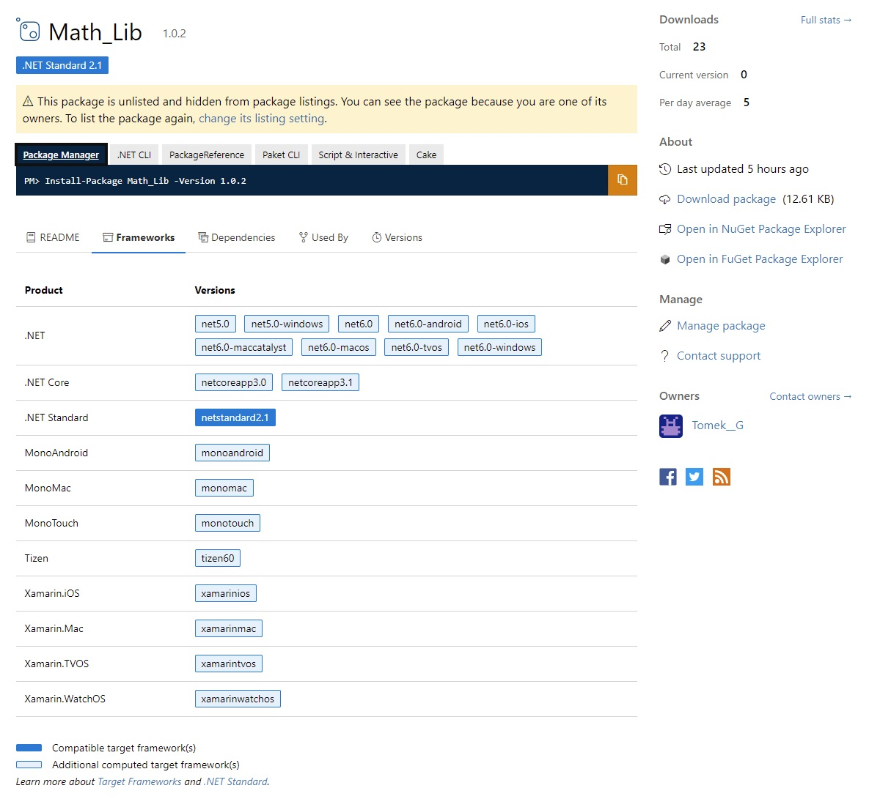
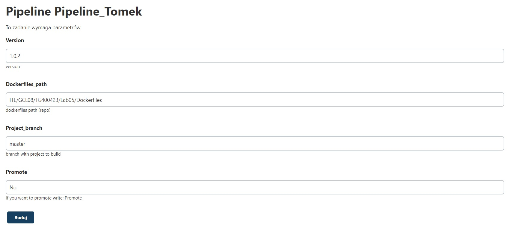
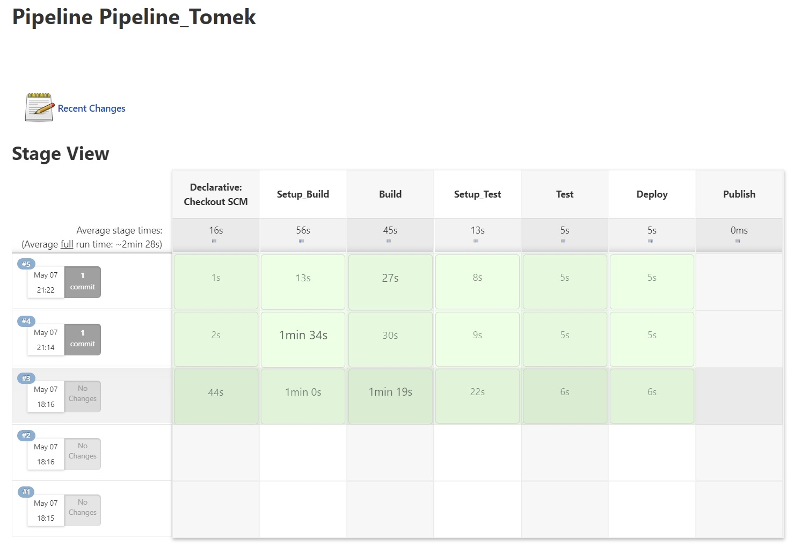
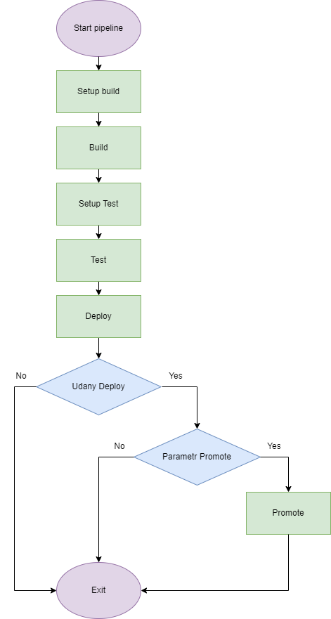

| Imie   | Nazwisko | Data       |
|--------|----------|------------|
| Tomasz | Gąsior   | 07.05.2022 |

# Woluminy
# 1. Cel projektu

Celem projektu było stworzenie "pipelinu" realizującego "stage" opisane w treści zadania. Niżej opisany pipeline buduję, \
testuję, realizuję deploy oraz publish prostej biblioteki matematycznej napisanej w C#

# 2. Streszczenie projektu
Do realizacji założonego celu posłużył Jankins zainstalowany na Dockerze. Przy pomocy tego narzędzia realizecję projektu podzielono na kilka "stage-y". \
Taka konstrukcja pomaga w prosty sposób podzielić skomplikowane zadanie na kilka mniejszych, łatwiejszych do realizacji kroków. \
Dzięki temu debugowanie takiego pipelinu jest znacznie szybsze. 

**W projekcie można wyróżnić następujące "stage-e":**

- Declarative: Checkout SCM (pobranie pliku Jankins z Github) 
- Setup_Build (tworzenie woluminów,podłączenie do repozytorium z programem, skopiowanie programu na wolumin, pobranie dockerfile-i, stworzenie obrazu docker realizującego budowę projektu) 
- Build (budowanie projektu, "odstawienie" zbudowanego projektu na wolumin wyjściowy) 
- Setup_Test (budowanie obrazu docker służącego do testowanie) 
- Test (testowanie programu)
- Deploy (uruchomienie zbudowanego programu (sprawdzenie czy zbudowany program działa)) 
- Publish (stworzenie paczki nuget, publikacja paczki na nuget Gallery) 

Szczegółowe omówienie "stage-y" przeprowadzone będzie w sekcji "Omówienie projektu". 

# 3. Omówienie projektu

Agent, Environment, Parameters

  ```
      agent any
      environment {
          DOTNET_CLI_HOME = "/tmp/DOTNET_CLI_HOME"
          NUGET_API_KEY = credentials('api-key')
      }
          
      parameters {
          string(name: 'Version', defaultValue: '1.0.2', description: 'version')
          string(name: 'Dockerfiles_path', defaultValue: 'ITE/GCL08/TG400423/Lab05/Dockerfiles', description: 'dockerfiles path (repo)')
          string(name: 'Project_branch', defaultValue: 'master', description: 'branch with project to build')
          string(name: 'Promote', defaultValue: 'No', description: 'If you want to promote write: Promote')
      }  
  ```

  Dyrektywa agent określa gdzie cały pipeline lub pojedyńczy stage będzie wykonany w środowisku Jankins.

  Sekcja environment zawiera zmienne środowiskowe zadeklarowane przez użytkownika: 

- zmienna DOTNET_CLI_HOME określa ścieżke do dotnet. Jeśli nie jest ustawiona domyśla wartość to HOME/USERPROFILE
- zmienna NUGET_API_KEY zmienna przechowuję sekret jakim jest klucz api który służy do wysyłania paczek nuget na nuget.org

 Sekcja parameters zawiera parametry utworzone przez użytkownika:

- Version: określa wersję wydawanego "programu" 
- Dockerfiles_path: określa ścieżkę do Dockerfile-i w repozytorium
- Project_branch: określa gałąź repozytorium z której budowany będzie projekt
- Promote: określe czy dany build będzie spakowany w paczkę nuget i wysłany na Nuget Gallery

# Omówienie "stage-y"
  1. **Declarative: Checkout SCM** \
Jest to krok tworzony automatycznie po zaznaczeniu opcji **Pipeline script form SCM**. Chcąc pobrać plik Jankinsfile (który opisuję tworzony pipeline) ze wskazanego repozytorium Github \
w sekcji SCM wybrano opcję **Git** następnie podano link do repozytorium, gałąź z przechowywanym plikiem, ścieżkę do pliku Jankinsfile.


  2. **Setup_Build** 

  ```
  stages {
        stage('Setup_Build') {
            steps {
                
                sh 'docker volume create in'
                sh 'docker volume create out'
                sh 'docker volume ls'
               
                sh 'mkdir -p App'
                dir("App")
                {
                    git branch: "${params.Project_branch}",
                    url: 'https://github.com/XxTomixX/GithubTestApp.git'
                    
                    sh 'docker container create --name copy -v in:/in busybox'
                    sh 'docker cp ./. copy:/in'
                    sh 'docker rm copy'
                
                    sh 'ls .'
                    sh 'ls GithubTestApp'
                    sh 'pwd'
                }
                
                sh 'mkdir -p Dockerfiles'
                dir("Dockerfiles")
                {
                    git branch: 'TG400423',
                    url: 'https://github.com/InzynieriaOprogramowaniaAGH/MDO2022_S.git'

                    sh "docker build -t build_app . -f ${params.Dockerfiles_path}/Dockerfile_Build"
                    sh "cd ${params.Dockerfiles_path} && ls -l"
                    sh 'ls .'
                }

            }
        }
        ...
  ```

  Pierwsze trzy komenty odpowiedają za utworzenie i wypisanie nowych woluminów. 
- Wolumin in przechowuję program do zbudowania
- Wolumin out przechowuję zbudowany program

  Następnie tworzony jest katalog w którym przechowywany będzie program. Parametr -p pozwala uniknąć błędu w przypadku jeśli taki katalog już istnieję. 

  Sekcja ``` dir("App") ``` ustawia katalog roboczy na App (po zakończeniu sekcji katalog roboczy wraca do poprzedniego stanu). \
  W tej sekcji pobierane jest repozytorium programu ze wskazanej gełęzi (git branch:) na wskzanym repozytoriun (url:) \
  w przypadku zabezpieczonego repozytorium należałoby jeszcze podać credentialsId: (credentials powinny być dodane w Jankins)

  Na potrzeby skopiowania repozytorium tworzymy kontener busybox i podłączamy do niego odpowiedni wolumin. \
  Wybrano obraz busybox pobierany z dockerhub ponieważ nie wymaga on wiele miejsca (1 - 5Mb). \
  Zapomocą komnedy ```  sh 'docker cp ./. copy:/in' ``` repozytorium kopiowane jest na wolumin. \
  Po skończonej pracy kontener jest usuwany ``` sh 'docker rm copy' ```

  Podobnie jak katalog App tworzony jest katalog Dockerfiles. \
  Po zmianie katalogu roboczego ``` dir("Dockerfiles") ``` pobierane jest repozytorium przechowujące "Dockerfile-e". \
  Dla przedstawienia że można kożystać z wielu repozytoriów jednocześnie pliki Dockerfile nie znajdują się na repozytorium programu. \
  Może się tak zdażyć jeśli mamy dwa zespoły deweloperskie. \
  
  Na podstawie pobranych plików tworzony jest docker image który będzie odpowiedał za budowanie programu. \

  Obraz tworzony na podstawie pliku Dockerfile_Build zawiera wszystkie potrzebne "dependencies" (.NET SDK (zawiera runtime)) potrzebne do zbudowania programu. \
  Dockerfile skonstruowany na podstawie dokumentacji: https://docs.microsoft.com/en-us/dotnet/core/install/linux-ubuntu \
  Dystrybucja ubuntu 20.04 została wybrana ponieważ wspiera środowisko dotnet 

  Dockerfile_Build

  ```dockerfile
  FROM ubuntu:20.04
  USER root

  ARG DEBIAN_FRONTEND=noninteractive
  RUN echo 'Building dotnet build image'

  RUN apt-get -y update
  RUN apt-get -y upgrade
  RUN apt-get -y install wget

  RUN wget https://packages.microsoft.com/config/ubuntu/20.04/packages-microsoft-prod.deb -O packages-microsoft-prod.deb
  RUN dpkg -i packages-microsoft-prod.deb
  RUN rm packages-microsoft-prod.deb

  RUN apt-get update; \
  apt-get install -y apt-transport-https && \
  apt-get update && \
  apt-get -y install dotnet-sdk-3.1
  ```

2. **Build**

```
...
 stage('Build') {
            agent {
                docker {
                    image 'build_app:latest'
                    args '--mount source=in,target=/in --mount source=out,target=/out -u root:root'
                }
            }
            steps {
                sh 'dotnet --info'
                sh 'ls /in/GithubTestApp'
                sh 'pwd /in/GithubTestApp'
                sh 'cd /in/GithubTestApp && dotnet build --output /out'
            }
        }
...
```

Za pomocą dyrektywy agent ustalane jest tak zwane **execution environment**. \
W tym przypadku będzie to obraz build_app zbudowany na podstawie Dockerfile_Build. \
Jest to obraz ubuntu 20.04 które wspiera środowisko dotnet. \ 
Do powstałego kontenera podpięte zostaną woluminy in oraz out. \
Czynności pozwalające na zbudowanie projektu za pomocą polecenia dotnet wymagają uprawnień administratora (dlatego -u root:root). \
Projektując pipeline założone zostało że wykonywany pipeline będzie posiadał uprawnienia administratora (kontenery dockera). \
Sekcja ```steps``` wykonywana jest wewnątrz uruchomionego kontenera. Pierwsze trzy polecenia wypisują wersję dotnet oraz ścieżki. \
Polecenie ``` sh 'cd /in/GithubTestApp && dotnet build --output /out' ``` wchodzi na wolumin wejściowy a następnie buduję projekt i "odkłada go" na wolumin wyjściowy. \
Nie zdecydowano się na użycie parametru ```--self-contained``` z uwagi na formę publikacji biblioteki. (paczka Nuget). \
Polecenie dotnet build zwraca cały zbudowany projekt program + testy + biblioteka (pliki .dll). Program kożystający z biblioteki oraz testy \
nie są potrzebne do wydania ponieważ celem jest opublikowanie samej biblioteki. Więcej o tym w stage-u ```Publish```. 


3. **Setup_Test**

```
...
stage('Setup_Test') {
            steps {
                dir("Dockerfiles")
                {
                    sh "docker build -t test . -f ${params.Dockerfiles_path}/Dockerfile_Test"
                }
            }
        }
...
```
Krótki stage służący do przygotowanie obrazu docker pozwalającego przeprowadzić testy. \
W katalogu roboczym ```Dockerfiles``` wykonujemy polecenie ```sh "docker build -t test . -f ${params.Dockerfiles_path}/Dockerfile_Test"``` \
Dzięki użyciu parametru ```${params.Dockerfiles_path}``` możemy zmieniać ścieżkę z której odczytywane są dockerfile-e. \
Należy zwrócić uwagę na fakt użycia ```sh " "``` zamiast ```sh ' '```. Tylko w pierwszym przypadku parametr zostanie prawidłowo odczytany.  

4. **Test**

```
...
stage('Test') {
            agent {
                docker {
                    image 'test:latest'
                    args '--mount source=in,target=/in -u root:root'
                }
            }
            steps {
                sh 'cd /in/GithubTestApp && dotnet test --no-build'
            }
        }
...
```

Za pomocą dyrektywy agent ustalane jest tak zwane **execution environment**. \
W tym przypadku będzie to obraz test zbudowany na podstawie Dockerfile_Test. \
Czynności pozwalające na testowanie projektu za pomocą polecenia dotnet wymagają uprawnień administratora (dlatego -u root:root). \
Polecenie dotnet test pozwala uruchimić testy jednostkowe zawarte w projekcie. Parametr ```--no-build``` zapobiega przebudowaniu projektu. \
Budowanie powinno się odbywać tylko w "stage-u" Build domyślnie wyniki testów powinny być zapisywane w folderze z projektem. 

5. **Deploy**

```
 stage('Deploy') {
            agent {
                docker {
                    image 'test:latest'
                    args '--mount source=out,target=/out'
                }
            }
            steps {
              
                sh 'ls -l' 
                sh 'cd /out && ls -l'

                timeout(time: 5, unit: 'SECONDS')
                {
                    sh 'cd /out && ./GithubTestApp'
                }
                sh 'echo $?'
                
            script {
                def result = sh (script: 'echo $?',returnStdout: true).trim();
                echo result
                if(result == "0")
                {
                    echo "Succesful deploy"
                }
                else
                {
                    echo "Unsuccesful deploy"
                    currentBuild.result = 'ABORTED'
                    error('Unsuccesful deploy…')
                }
            }
          }
        }
  ``` 
Za pomocą dyrektywy agent ustalane jest tak zwane **execution environment**. \
W tym przypadku również będzie to obraz test. Obraz test posiada już zainstalowane środowisko uruchomieniowe dotnet. \
Obraz zawiera SDK które nie jest potrzebne do przeprowadzenia "deployment" ale pozwala nam to zaoszczędzić czas i zasoby \
na tworzeniu specjalnego obrazu służącego wyłącznie do tego celu. Forma wydania biblioteki (paczka nuget) nie potrzebuję \
specjalnego środowiska (środowisko zbliżone do środowiska produkcjyjnego).

Wewnątrz kontenera wykonywana jest komenda ```sh 'cd /out && ./GithubTestApp'``` która uruchamia zbudowany program. \
Polecenie to znajduję się w specjalnej sekcji nakładającej ograniczenie czasowe na wykonanie pewnego zadania (w tym przypadku uruchomienie programu) \
```timeout(time: 5, unit: 'SECONDS')``` time: ilość czasu, unit: jednostka czasu (sekundy, godziny)

Sekcja script pozwala uruchomić blok ```Scripted Pipeline``` wewnątrz ```Declarative Pipeline```. (Scripted Pipeline pozwala wykonywać dodatkowe funkcje zawarte w Groovy) \
Prosty skrypt sprawdza wynik programu uruchomionego w kontenerze. Jeśli program wykonał się poprawnie i zwrócił 0 to deploy wykonał się poprawnie. W innym przypadku \
ustawiamy globalną zmienną  ```currentBuild.result = 'ABORTED'``` oraz wysyłamy error (zatrzymanie pipelinu).


6. **Publish**
```
...
stage('Publish') {
            when {
                expression {
                    return params.Promote == "Promote";
                }
            }
            agent {
                docker {
                    image 'test:latest'
                    args '--mount source=in,target=/in --mount source=out,target=/out -u root:root'
                }
            }
            steps {
                sh 'cd /out && ls -l'
                sh 'cd /in && ls -l'
                sh 'cd /in/TestowaBiblioteka && ls -l'

                sh "cd /in/TestowaBiblioteka && dotnet pack -p:PackageVersion=${params.Version} --no-build -o /out /p:OutputPath=/out"
                sh 'cd /out && ls -l'
       
                sh "cd /out && dotnet nuget push Math_Lib.${params.Version}.nupkg -k $NUGET_API_KEY -s https://api.nuget.org/v3/index.json"
            }
        }
    }
}
```

Stage Publish wykonywany jest tylko pod warunkiem że spełniony jest pewien warunek. \
W przypadku tego pipelinu parametr Promote musi posiadać odpowiednią wartość. \
Tylko wtedy zostanie wykonana pozostała część stage-a. \

Za pomocą dyrektywy agent ustalane jest tak zwane **execution environment**. \
W tym przypadku również będzie to obraz test. Obraz test posiada już zainstalowane środowisko dotnet. \
Za pomocą dotnet pack oraz dotnet nuget możliwe jest stworzenie paczki i opublikowanie jej. \
Z tego powodu nie ma potrzeby tworzenia osobnego obrazu przeznaczonego do publikowania.

```sh "cd /in/TestowaBiblioteka && dotnet pack -p:PackageVersion=${params.Version} --no-build -o /out /p:OutputPath=/out"```
1. ```-p:PackageVersion=${params.Version}``` ustawia numer wersji tworzonej paczki (numer wersji przechowywany w parametrze)
2. ```--no-build```  zapobiega przebudowaniu projektu
3. ```-o /out /p:OutputPath=/out``` folder do której trafi zbudowana paczka 

 ```sh "cd /out && dotnet nuget push Math_Lib.${params.Version}.nupkg -k $NUGET_API_KEY -s https://api.nuget.org/v3/index.json"```
 1. ```Math_Lib.${params.Version}.nupkg``` zbudowana paczka o konkretnej wersji która zostanie opublikowana
 2. ```-k $NUGET_API_KEY``` klucz api pozwalający opublikować paczkę na nuget Gallery, klucz przechowywany jest w zmiennej środowiskowej pobierany z credentials
 3. ```-s https://api.nuget.org/v3/index.json``` określa adres URL serwera (nuget.org)

Opublikowana paczka dostępna jest na nuget.org



Uruchomienie pipeline (Podanie parametrów)



Wynik.



# Plik .csproj

Aby paczka została prawidłowo utworzona do pliku TestowaBiblioteka.csproj 
dodano następujący kod:

```
<Project Sdk="Microsoft.NET.Sdk">

 <PropertyGroup>
    <TargetFramework>netstandard2.1</TargetFramework>
    <PackageId>Math_Lib</PackageId>
    <Version>1.0.0</Version>
    <Authors>Tomasz Gąsior</Authors>
    <Company>Firma</Company>
  </PropertyGroup>

</Project>
```

Jest to opis paczki która ma pyć utworzona. 
Pole Version będzie nadpisane przez polecenie dotnet pack.


# Diagramy
 # Diagram aktywności 

 # Diagram wdrożenia  

